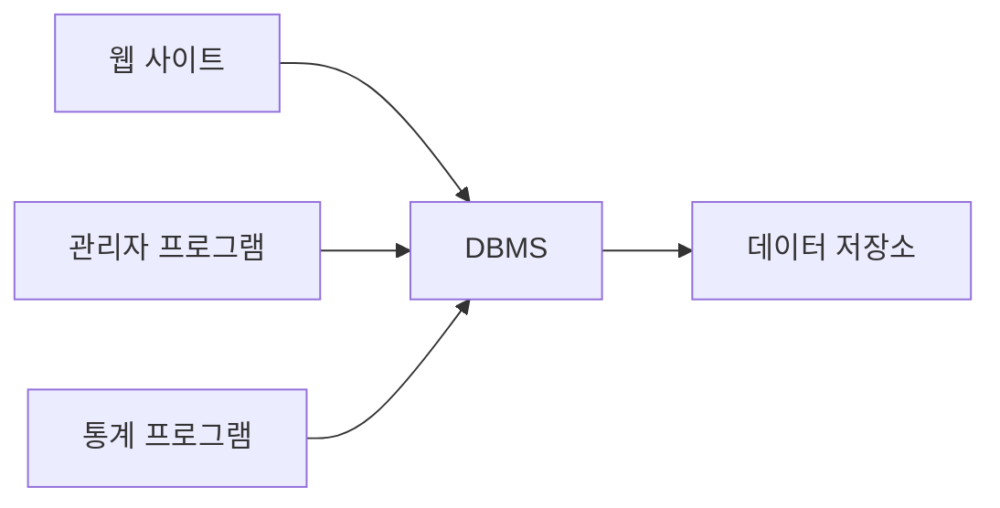
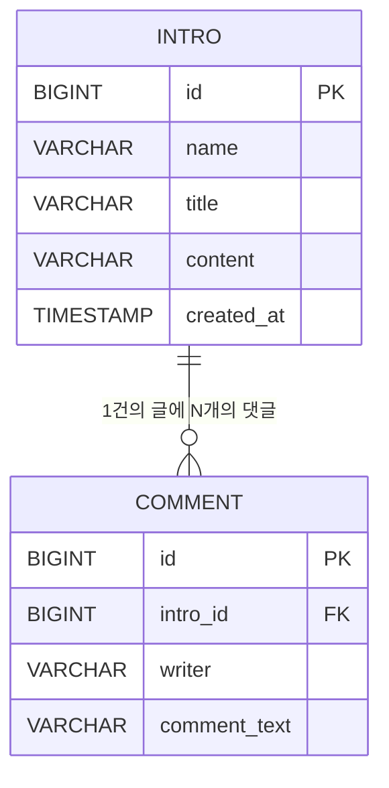
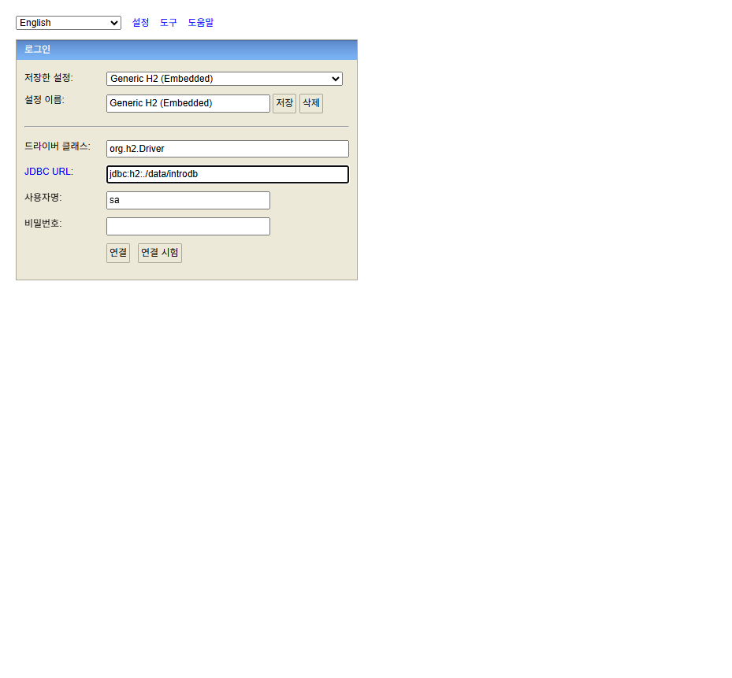

# 01. 데이터베이스 기본 개념

> **이 문서에서 배우는 것**
> - 파일 저장의 한계와, 그 문제를 해결하는 DBMS의 역할
> - 관계형 데이터베이스의 핵심 구조: 테이블 · 행 · 열 · 데이터 타입 · NULL
> - 기본키(PK)와 외래키(FK)가 왜 필요한지
> - H2 콘솔을 직접 띄우고 접속해 보기

---

## 1. 왜 데이터베이스인가

여러분은 이미 GitHub Pages로 자기소개 페이지를 만들어 봤습니다.
이번에는 방문자들이 **자기소개서를 작성해서 저장**할 수 있게 한다고 상상해 봅시다.

가장 단순한 방법은 자기소개서 한 건을 메모장 파일(`intro_001.txt`, `intro_002.txt`, ...)로 저장하는 것입니다.
처음엔 잘 돌아갑니다. 그런데 자기소개서가 1,000건이 되면 어떤 일이 벌어질까요?

| # | 상황 | 파일 저장의 문제 |
|---|------|----------------|
| 1 | 1,000건 중 '김철수'가 쓴 글만 찾고 싶다 | 파일 1,000개를 **전부 열어서** 확인해야 합니다 |
| 2 | 두 명이 같은 글을 동시에 수정한다 | 나중에 저장한 쪽이 덮어써서 **한 명의 수정이 사라집니다** |
| 3 | 제목 없이 내용만 쓴 글이 들어온다 | 파일은 형식을 강제하지 못해 **깨진 데이터**가 쌓입니다 |
| 4 | 저장 도중에 프로그램이 죽는다 | 반쯤 쓰다 만 **깨진 파일**이 남습니다 |

이 네 가지는 데이터를 다루는 모든 프로그램이 마주치는 고전적인 문제입니다.
그래서 사람들은 이 문제만 전문적으로 해결하는 프로그램을 따로 만들었습니다.
그것이 **DBMS(Database Management System, 데이터베이스 관리 시스템)** 입니다.

DBMS는 위 문제를 이렇게 해결합니다.

1. **검색**: 색인(인덱스)을 이용해 1,000건이든 100만 건이든 원하는 데이터를 빠르게 찾아 줍니다.
2. **동시성 제어**: 여러 명이 동시에 수정해도 데이터가 꼬이지 않게 순서를 관리합니다.
3. **형식 보장**: "제목은 반드시 있어야 한다" 같은 규칙을 테이블에 정의하면, 규칙에 어긋난 데이터는 저장 자체를 거부합니다.
4. **장애 복구**: 저장 도중 프로그램이 죽어도, "완전히 저장됨" 아니면 "저장 전 상태" 둘 중 하나만 남도록 보장합니다.

구조로 보면 이렇습니다. 프로그램이 파일을 직접 읽고 쓰는 대신, 중간에 데이터 전문가(DBMS)를 두는 것입니다.



여러 프로그램이 같은 데이터를 써도, 저장·검색·규칙·복구는 전부 DBMS가 책임집니다.
프로그램은 DBMS에게 "이 데이터를 저장해 줘", "김철수의 글을 찾아 줘"라고 **요청**만 하면 됩니다.
이 요청에 쓰는 언어가 뒤에서 배울 SQL입니다.

앞으로 여러분이 만들 거의 모든 프로그램은 데이터를 DBMS에 맡깁니다.
이 모듈에서는 SQL과 JDBC(Java Database Connectivity — 자바 프로그램이 DBMS에 접속해 SQL을 실행하게 해 주는 표준 연결 방법)로 DBMS를 **직접** 다뤄 보고, 그다음 [스프링부트 교육](../Spring/SpringBoot/README.md)에서 "이 고생을 스프링이 어떻게 대신해 주는지" 확인하게 됩니다.

---

## 2. 관계형 데이터베이스 — 데이터를 표로 관리한다

DBMS 중에서 가장 널리 쓰이는 방식이 **관계형 데이터베이스(RDB, Relational Database)** 입니다.
핵심 아이디어는 단순합니다. **모든 데이터를 표(테이블) 형태로 관리한다.**

이 모듈 전체에서 사용할 `intro`(자기소개서) 테이블을 실제 표로 보면 이렇습니다.

| id | name | title | content | created_at |
|---:|------|-------|---------|------------|
| 1 | 김철수 | 안녕하세요, 김철수입니다 | 성실함이 무기인 예비 개발자입니다... | 2026-07-07 09:30:00 |
| 2 | 이영희 | 백엔드 개발자를 꿈꿉니다 | 자바와 SQL을 공부하고 있습니다... | 2026-07-07 10:12:00 |
| 3 | 김철수 | 두 번째 자기소개서 | *(NULL)* | 2026-07-07 11:05:00 |

- **행(row)** = 가로 한 줄 = **자기소개서 한 건**. 위 표에는 자기소개서가 3건 있습니다.
- **열(column)** = 세로 한 칸 = **항목**. 모든 자기소개서는 같은 항목(작성자, 제목, 내용, 작성시각)을 갖습니다.

각 열에는 **데이터 타입**이 정해져 있습니다. "이 칸에는 이런 종류의 값만 들어갈 수 있다"는 규칙입니다.

| 컬럼 | 타입 | 의미 |
|------|------|------|
| id | `BIGINT` | 큰 범위의 정수 (자동증가 번호) |
| name | `VARCHAR(100)` | 최대 100자의 문자열 (작성자) |
| title | `VARCHAR(200)` | 최대 200자의 문자열 (제목) |
| content | `VARCHAR(4000)` | 최대 4000자의 문자열 (내용) |
| created_at | `TIMESTAMP` | 날짜 + 시각 (작성시각) |

앞서 본 "형식 보장"이 바로 이것입니다. `created_at` 열에 "어제쯤"이라는 문자열을 넣으려 하면 DBMS가 거부합니다.

한 가지 특별한 값이 **NULL** 입니다. 3번 행의 content처럼 **"값이 아직 없음"** 을 나타냅니다.
빈 문자열("")이나 0과는 다른, "칸 자체가 비어 있다"는 뜻입니다. 열을 정의할 때 `NOT NULL`을 붙이면 "이 칸은 비워둘 수 없다"는 규칙이 됩니다.

---

## 3. 기본키(PK) — 행을 유일하게 구분하는 값

위 표를 다시 보면 '김철수'가 쓴 글이 두 건입니다. 여기서 문제가 생깁니다.

> "김철수의 자기소개서를 수정해 주세요" — **어느 김철수의, 어느 글을요?**

이름으로는 행을 특정할 수 없습니다. 동명이인이 있을 수 있고, 같은 사람이 글을 여러 개 쓸 수도 있으니까요.
그래서 모든 테이블에는 **행 하나를 유일하게 구분하는 값**을 둡니다. 이것이 **기본키(PK, Primary Key)** 입니다.

`intro` 테이블의 기본키는 `id`입니다. "3번 글을 수정해 주세요"라고 하면 정확히 한 건이 특정됩니다.
기본키에는 두 가지 규칙이 있습니다.

1. **중복 불가**: 같은 id를 가진 행이 두 개일 수 없습니다.
2. **NULL 불가**: id가 비어 있는 행은 존재할 수 없습니다.

그런데 왜 이름이나 이메일 같은 "실제 정보"를 기본키로 쓰지 않고, 의미 없는 자동증가 번호를 쓸까요?

- 이름은 **중복**될 수 있습니다(동명이인).
- 이메일은 유일해 보이지만 **바뀔 수 있습니다**(회사 이메일 변경 등). 기본키가 바뀌면 그 값을 참조하던 모든 곳을 함께 고쳐야 해서 위험합니다.

그래서 실무에서는 대부분 **변하지 않고, 의미도 없는 자동증가 번호**(1, 2, 3, ...)를 기본키로 씁니다.
DBMS가 행이 추가될 때마다 번호를 자동으로 매겨 주므로 개발자가 신경 쓸 것도 없습니다.

---

## 4. 외래키(FK)와 관계 — "관계형"이라는 이름의 유래

자기소개서에 **댓글** 기능을 붙인다고 상상해 봅시다. 댓글도 데이터이니 테이블이 필요합니다.
그런데 댓글은 반드시 **"어느 자기소개서에 달린 댓글인지"** 를 알아야 합니다.

방법은 간단합니다. 댓글 테이블에 **부모 글의 기본키(id)를 저장하는 열**을 하나 두면 됩니다.

| id | intro_id | writer | comment_text |
|---:|---------:|--------|--------------|
| 1 | 1 | 박민수 | 잘 읽었습니다! |
| 2 | 1 | 최지훈 | 응원합니다. |
| 3 | 2 | 박민수 | 백엔드 화이팅! |

`intro_id` 열이 `intro` 테이블의 `id`를 가리킵니다. 이런 열을 **외래키(FK, Foreign Key)** 라고 합니다.
외래키를 선언하면 DBMS는 "존재하지 않는 글(예: intro_id = 999)에 댓글을 다는 것"을 거부합니다. 데이터의 앞뒤가 맞도록 지켜 주는 것입니다.

자기소개서 1건에 댓글이 여러 건 달릴 수 있으므로, 두 테이블은 **1:N(일대다) 관계**입니다.



테이블들이 이렇게 키를 통해 서로 **관계**를 맺기 때문에 "관계형 데이터베이스"라고 부릅니다.

> **참고**: `comment` 테이블은 관계를 이해하기 위한 예시일 뿐입니다.
> 이 모듈의 실습에서는 `intro` 테이블 하나만 만듭니다.

---

## 5. 용어 정리

지금까지 나온 용어를 표 하나로 정리합니다. 앞으로 계속 쓰이니 눈에 익혀 두세요.

| 용어 | 뜻 |
|------|-----|
| 데이터베이스 / 스키마 | 관련된 테이블들을 담는 큰 보관함 (제품에 따라 두 용어를 섞어 씁니다) |
| 테이블(table) | 데이터를 담는 표. 예: `intro` |
| 행(row) / 레코드 | 표의 가로 한 줄 = 데이터 한 건. 예: 자기소개서 1건 |
| 열(column) / 컬럼 | 표의 세로 한 칸 = 항목. 예: `title` |
| DBMS | 데이터베이스를 관리하는 프로그램. 예: MySQL, Oracle, H2 |
| SQL | DBMS에게 일을 시키는 표준 언어 ([03 문서](./03_SQL_기초.md)에서 본격 학습) |

---

## 6. DBMS의 종류와 SQL

관계형 DBMS에는 여러 제품이 있습니다. **MySQL, PostgreSQL, Oracle, H2** 등이 대표적입니다.
다행인 것은, 제품이 달라도 전부 **SQL(Structured Query Language)** 이라는 표준 언어로 다룬다는 점입니다.
제품마다 문법이 조금씩 다른 부분(방언)이 있지만, 이 모듈에서 배우는 기본 SQL은 어디서나 통합니다.

제품별 특징 비교, NoSQL, 최근 트렌드는 참고자료 PDF가 잘 정리하고 있으니 그쪽에 맡깁니다.

> 📄 [데이터베이스 입문 (인턴·초급 개발자용)](../99_참고자료/데이터베이스_입문_인턴초급개발자.pdf) — DB 종류(관계형/NoSQL/인메모리)와 트렌드 3쪽 개관

**실무 이야기를 하나만 하겠습니다.**
우리 회사 프로젝트는 전자정부 표준프레임워크(eGovFrame)에 **MyBatis**를 조합해서 씁니다.
MyBatis는 개발자가 작성한 SQL을 XML 파일에 그대로 담아 실행하는 도구입니다. 즉, 프레임워크가 SQL을 대신 만들어 주지 않고 **개발자가 SQL을 직접 작성**합니다.
실무 DB도 Oracle, MySQL 같은 서버형 DB입니다. 그래서 이 모듈에서 익히는 **SQL 실력이 곧 실무 실력**입니다. 대충 넘어가면 현장에서 바로 티가 납니다.

---

## 7. 실습 준비: H2 시작하기

이 모듈의 실습 DB는 **H2**입니다. 이유는 두 가지입니다.

1. **설치가 없습니다.** jar 파일 하나를 내려받아 실행하면 끝입니다. (Oracle·MySQL 같은 서버형 DB는 설치와 초기 설정이 꽤 무겁습니다)
2. **스프링 교육 실습이 같은 H2를 씁니다.** 여기서 익힌 환경 그대로 스프링부트 실습으로 이어집니다.

### ① JDK 17 확인

터미널(명령 프롬프트)에서 자바 버전을 확인합니다.

```
java -version
```

`17.x.x` 이상이 출력되면 준비 완료입니다. 자바가 없거나 버전이 낮다면 강사에게 문의하세요.

### ② H2 jar 다운로드

아래 링크에서 `h2-2.3.232.jar` 파일 하나를 내려받습니다.

- https://repo1.maven.org/maven2/com/h2database/h2/2.3.232/h2-2.3.232.jar

내려받은 파일을 실습용 작업 폴더(예: `C:\work\db-training`)에 둡니다.

### ③ H2 콘솔 실행

터미널에서 작업 폴더로 이동한 뒤 실행합니다.

```
cd C:\work\db-training
java -jar h2-2.3.232.jar
```

잠시 후 브라우저에 **H2 콘솔**(로그인 화면)이 자동으로 열립니다.
열리지 않으면 터미널에 출력된 주소를 브라우저 주소창에 직접 입력하세요.

### ④ 접속하기

로그인 화면에서 아래 세 칸만 확인하고 나머지는 그대로 둡니다.

| 항목 | 입력값 |
|------|--------|
| JDBC URL | `jdbc:h2:./data/introdb` |
| User Name | `sa` |
| Password | (비워 둠) |



**Connect** 버튼을 누르면 SQL을 입력할 수 있는 화면이 나옵니다. 여기까지 되면 오늘의 목표 달성입니다.
접속에 성공하면 작업 폴더 아래에 `data` 폴더와 DB 파일이 생긴 것도 확인해 보세요.

### 자주 겪는 문제

| 증상 | 원인과 해결 |
|------|------------|
| `'java'은(는) 내부 또는 외부 명령...이 아닙니다` | JDK가 설치되지 않았거나 PATH에 없습니다. ①번부터 다시 확인하세요 |
| 실행했는데 브라우저가 열리지 않음 | 터미널에 출력된 주소를 브라우저에 직접 입력하세요 |
| 실행 시 포트 관련 오류(BindException 등) | H2 콘솔이 이미 떠 있는 경우입니다. 기존 터미널 창을 닫고 다시 실행하세요 |
| 접속 시 `Database may be already in use` | 같은 DB 파일에 다른 접속이 남아 있는 경우입니다. 다른 H2 창을 모두 닫고 다시 접속하세요 |

터미널 창을 닫으면 H2 콘솔도 함께 종료됩니다. 실습 중에는 터미널 창을 그대로 켜 두세요.

> 방금 입력한 JDBC URL, 사용자 이름 같은 **접속 화면의 각 칸이 무슨 뜻인지는 다음 문서(02)에서 하나씩 해부합니다.**
> 지금은 "이렇게 하면 접속된다"까지만 알면 충분합니다.

---

## 스스로 점검하기

다음 질문에 답할 수 있으면 이 문서는 통과입니다.

1. 자기소개서를 파일로 저장할 때 생기는 문제 4가지 중 3가지를 말할 수 있나요?
2. `intro` 테이블에서 행 하나는 무엇을 의미하나요?
3. 이름 대신 자동증가 번호(`id`)를 기본키로 쓰는 이유는 무엇인가요?
4. `comment` 테이블의 `intro_id` 같은 열을 무엇이라고 부르고, 어떤 역할을 하나요?

---

| 이전 | 다음 |
|------|------|
| [README (학습 로드맵)](./README.md) | [02. 접속과 권한](./02_접속과_권한.md) |
