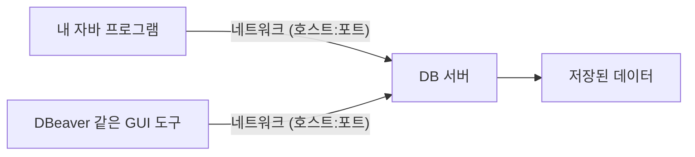

# 02. 접속과 권한

> **이 문서에서 배우는 것**
>
> - 실무의 DB가 "항상 켜져 있는 별도 서버"라는 것과, 실습용 H2 파일 모드가 그것과 어떻게 다른지
> - DB에 접속할 때 필요한 5가지 정보(접속 5요소)와, 그것을 한 줄에 담은 JDBC URL 읽는 법
> - 계정과 권한을 왜 나누는지 — 관리자 / 애플리케이션 / 조회 전용 계정의 차이
> - 접속정보를 다룰 때 지켜야 할 실무 보안 수칙 4가지

---

## 1. DB 서버라는 개념

[01_데이터베이스_기본개념.md](./01_데이터베이스_기본개념.md)에서 DB가 "데이터를 안전하게 보관·관리하는 전문 프로그램"이라고 했습니다. 그렇다면 그 프로그램은 어디에서 돌아가고 있을까요?

실무의 DB는 대부분 **항상 켜져 있는 별도의 서버 프로그램**입니다. 내 자바 프로그램이나 DBeaver 같은 GUI 도구는 그 서버에 **네트워크로 접속**해서 데이터를 읽고 씁니다. DB 서버는 보통 내 PC가 아니라 다른 컴퓨터(사내 서버, 클라우드)에서 돌아갑니다.



여기서 중요한 점은 **여러 프로그램이 같은 DB 서버에 동시에 접속한다**는 것입니다. 웹 애플리케이션도, 개발자의 GUI 도구도, 배치 프로그램도 모두 같은 서버에 붙습니다. 그래서 "누가 접속하는가(계정)"와 "무엇을 할 수 있는가(권한)"를 구분하는 것이 중요해집니다 — 이것이 이 문서 후반부의 주제입니다.

### 실습용 H2는 왜 접속이 단순한가 — 임베디드 방식

반면 우리가 실습에 쓰는 H2 파일 모드는 다릅니다. `jdbc:h2:./data/introdb`처럼 접속하면, **별도 서버 없이 내 프로그램이 직접 파일을 열어서** 사용합니다. 이런 방식을 **임베디드(embedded)** 방식이라고 합니다.

| 구분 | 서버 방식 (실무: MySQL, Oracle 등) | 임베디드 방식 (실습: H2 파일 모드) |
|---|---|---|
| DB 프로그램 실행 | 별도 서버가 항상 떠 있음 | 내 프로그램 안에서 함께 실행 |
| 접속 경로 | 네트워크 (호스트 + 포트) | 파일 경로 |
| 동시 사용 | 여러 프로그램이 동시 접속 | 기본적으로 한 프로그램이 사용 |

그래서 H2 파일 모드의 접속정보에는 **호스트와 포트가 없습니다.** 실습이 단순해지는 대신, "네트워크 너머의 서버에 접속한다"는 실무 감각은 이 문서에서 개념으로 먼저 익혀 두고, [05_심화_도커로_MySQL.md](./05_심화_도커로_MySQL.md)에서 진짜 서버형 DB로 체험합니다.

---

## 2. 접속 5요소

서버형 DB에 접속하려면 다섯 가지 정보가 필요합니다. 웹사이트에 비유하면 **"주소를 입력해서 사이트에 찾아간 뒤, 아이디와 비밀번호로 로그인하는 것"**과 같습니다.

| 요소 | 무엇을 뜻하나 | 예시 |
|---|---|---|
| 호스트(host) | 어느 컴퓨터인가 | `localhost`, `192.168.0.10`, `db.example.com` |
| 포트(port) | 그 컴퓨터의 몇 번 문인가 | MySQL `3306`, PostgreSQL `5432`, Oracle `1521` (관례) |
| 데이터베이스 이름 | 그 서버 안의 어느 데이터 묶음인가 | `introdb` |
| 사용자(user) | 누구로 접속하는가 | `sa`, `app_user` |
| 비밀번호(password) | 본인 확인 | (비공개) |

몇 가지 보충 설명입니다.

1. **호스트** — `localhost`는 "내 컴퓨터 자신"을 뜻하는 특별한 이름입니다. 실무에서는 IP 주소나 도메인 이름으로 다른 서버를 가리키는 경우가 대부분입니다.
2. **포트** — 한 컴퓨터에는 여러 프로그램이 떠 있을 수 있으므로, 번호로 문을 구분합니다. 표의 포트 번호는 각 DB의 **기본값(관례)**일 뿐이라, 서버 설정에 따라 다른 번호를 쓸 수도 있습니다.
3. **데이터베이스 이름** — DB 서버 하나가 여러 프로젝트의 데이터베이스를 품을 수 있어서, 그중 어느 것에 접속할지 지정합니다.

### 개발 DB와 운영 DB는 분리되어 있다

실무에서 꼭 알아야 할 사실 하나: **개발용 DB와 운영용 DB는 별도의 서버로 분리되어 있고, 접속정보(호스트·계정·비밀번호)도 다릅니다.** 개발 중에 데이터를 마음껏 넣고 지우는 곳은 개발 DB이고, 실제 사용자의 데이터가 있는 운영 DB는 접속 자체가 엄격하게 관리됩니다. "지금 내가 붙어 있는 DB가 어느 쪽인지" 확인하는 습관은 5장에서 다시 이야기합니다.

---

## 3. JDBC URL 해부

자바에서 DB에 접속할 때는 접속 5요소 중 **호스트·포트·DB 이름을 한 줄의 문자열**에 담아서 전달합니다. 이것이 **JDBC URL**입니다. (사용자와 비밀번호는 보통 별도 항목으로 전달합니다.)

세 가지 예를 분해해 보겠습니다.

**① 실습에서 쓰는 H2 (임베디드)**

```
jdbc:h2:./data/introdb
 └─┬─┘└┬┘└─────┬─────┘
  jdbc  h2라는   이 위치의 파일을
  규격  DB에     직접 연다
```

임베디드 방식이므로 호스트·포트 없이 **파일 경로**만 있습니다.

**② MySQL (서버 방식)**

```
jdbc:mysql://localhost:3306/introdb
 └─┬─┘└─┬─┘  └───┬───┘└─┬─┘└──┬──┘
  jdbc MySQL   호스트    포트  DB 이름
```

2장의 접속 5요소 중 세 가지가 그대로 보입니다. 호스트 `localhost`, 포트 `3306`, DB 이름 `introdb`.

**③ Oracle (형태만 소개)**

```
jdbc:oracle:thin:@호스트:1521/서비스명
```

Oracle은 `@` 뒤에 호스트·포트·서비스명이 오는 형태입니다. 지금은 "DB 제품마다 URL 형태가 조금씩 다르지만, 결국 담는 정보는 같다" 정도만 기억하면 됩니다.

### 스프링에서 다시 만납니다

스프링부트 교육에서 `application.properties`에 적는 `spring.datasource.url`이 **바로 이 JDBC URL**입니다. 스프링이 마법처럼 DB를 찾아가는 것이 아니라, 우리가 여기서 배운 접속정보를 설정 파일에 적어 주는 것뿐입니다. [../Spring/SpringBoot/02_프로젝트_구조.md](../Spring/SpringBoot/02_프로젝트_구조.md)에서 해당 설정을 다시 확인해 보세요.

> **실무 연결** — 회사 실무의 전자정부 표준프레임워크(eGovFrame) 프로젝트에서도 DB 접속정보는 설정 파일(데이터소스 설정)에 JDBC URL 형태로 들어갑니다. 프로젝트에 처음 투입되면 "개발 DB 접속정보를 설정 파일에 넣는 일"부터 하게 되는 경우가 많으니, 이 URL을 읽을 줄 아는 것이 곧 실무 첫걸음입니다.

---

## 4. 클라이언트 도구 — 도구가 달라도 접속정보는 같다

DB 서버에 접속하는 프로그램을 통칭해서 **클라이언트**라고 합니다. 자바 프로그램도 클라이언트지만, 사람이 직접 SQL을 입력하고 결과를 확인하는 도구들도 있습니다.

| 도구 | 특징 | 우리 교육에서 |
|---|---|---|
| H2 콘솔 | H2에 내장된 웹 화면. `java -jar h2-2.3.232.jar`로 실행 | 03·04 문서의 실습 도구 |
| DBeaver | 무료, 거의 모든 DB 지원. 실무에서 가장 널리 쓰이는 GUI | 설치해 두기를 권장 |
| 각 DB의 CLI | 터미널에서 쓰는 명령줄 도구 (`mysql` 명령 등) | 05 문서에서 잠깐 사용 |

여기서 핵심은 도구 비교가 아니라 이것입니다.

> **어떤 도구를 쓰든, 입력하는 접속정보는 같다.**

H2 콘솔이든 DBeaver든 자바 코드든, 결국 2장의 접속 5요소(또는 그것을 담은 JDBC URL)를 입력합니다. 새 도구를 만나도 "접속 5요소를 어디에 입력하는지"만 찾으면 됩니다. 실제로 DBeaver의 접속 생성 화면을 열어 보면 Host, Port, Database, Username, Password 입력란이 그대로 있습니다.

---

## 5. 권한 — 왜 계정을 나누나

업계에서 오래 회자되는 단골 사고가 있습니다.

> 신입 개발자가 개발 DB인 줄 알고 열어 둔 창에서 `DELETE FROM ...`을 실행했는데, 알고 보니 **운영 DB**였다.

이 사고의 원인을 "신입의 부주의"로만 돌리면 같은 사고가 반복됩니다. 사람은 누구나 실수하기 때문입니다. 그래서 실무에서는 **애초에 그 계정으로는 그 일을 할 수 없게** 만들어 사고의 반경을 줄입니다. 이것이 계정과 권한을 나누는 이유입니다.

전형적인 계정 구성은 세 단계입니다.

1. **관리자 계정** (MySQL의 `root`, H2의 `sa` 등) — 모든 권한. 테이블 생성/삭제, 계정 관리까지 가능합니다. 그래서 **관리 작업을 할 때만** 사용하고, 평소 애플리케이션 연결에는 쓰지 않습니다.
2. **애플리케이션용 계정** — 서비스가 돌아가는 데 필요한 권한만 줍니다(**최소 권한 원칙**). 보통 `SELECT/INSERT/UPDATE/DELETE`(데이터 조작)는 주고, `DROP/CREATE` 같은 **구조 변경 권한은 주지 않습니다.** 애플리케이션에 버그가 있거나 계정이 유출되더라도 테이블 자체를 날리는 일은 막히는 것입니다.
3. **조회 전용 계정** — `SELECT`만 가능한 계정. 데이터 분석이나 현황 조회를 하는 사람에게 줍니다. 이 계정으로는 위 사고의 `DELETE`가 **실행 자체가 거부**됩니다.

권한을 주고 뺏는 SQL 명령이 `GRANT`(부여)와 `REVOKE`(회수)입니다. 형태만 미리 보면 이렇습니다.

```sql
GRANT SELECT, INSERT ON introdb.* TO 'app_user'@'%';
```

"`introdb`의 모든 테이블에 대해 `app_user` 계정에게 조회와 입력 권한을 준다"는 뜻입니다. 정확한 문법과 실습은 [05_심화_도커로_MySQL.md](./05_심화_도커로_MySQL.md)에서 MySQL로 직접 해 봅니다.

> **실습 H2와 실무의 차이** — 우리 실습은 관리자 계정 `sa` 하나로만 진행합니다. 혼자 쓰는 임베디드 DB라서 괜찮은 것이고, **실무에서는 관리자 계정으로 애플리케이션을 연결하지 않는다**는 점을 기억해 두세요.

---

## 6. 접속정보 보안 수칙

접속정보(특히 비밀번호)는 그 자체가 "DB의 열쇠"입니다. 아래 4가지는 실무에서 기본으로 요구되는 수칙입니다. 겁을 주려는 것이 아니라, **한번 습관이 되면 지키는 데 드는 비용이 0**이기 때문에 처음부터 몸에 붙이는 것이 이득입니다.

1. **비밀번호를 소스코드·깃 저장소에 하드코딩하지 않기** — 깃에 한 번 커밋된 비밀번호는 이력에 영원히 남습니다. 스프링의 `application.properties`에 적는 비밀번호도, 실무에서는 환경변수나 별도 설정 파일로 분리해 저장소 밖에서 주입합니다. (교육용 H2는 비밀번호가 없어서 예외적으로 단순합니다.)
2. **운영 DB 접속정보를 채팅·공유문서에 평문으로 남기지 않기** — 메신저 대화와 공유 문서는 검색되고, 오래 남고, 생각보다 많은 사람이 봅니다. 접속정보 전달은 회사가 정한 안전한 경로를 따릅니다.
3. **화면 공유·스크린샷에 접속정보가 노출되지 않게 주의하기** — 화면 공유 중 설정 파일을 열거나, 접속 창이 찍힌 스크린샷을 공유하는 순간 유출됩니다. 공유 전에 열려 있는 창을 한 번 확인하는 습관이면 충분합니다.
4. **퇴사자·프로젝트 종료 시 계정 회수** — "그 사람이 나갔는데 계정은 살아 있는" 상태가 보안 사고의 흔한 출발점입니다. 계정을 사람·용도별로 나눠 두는 이유(5장)가 여기서도 드러납니다. 나눠 두었기 때문에 하나만 깔끔하게 회수할 수 있습니다.

---

## 정리

- 실무 DB는 **네트워크 너머의 서버**이고, 실습 H2 파일 모드는 **서버 없는 임베디드** 방식입니다.
- 접속에 필요한 것은 **호스트·포트·DB 이름·사용자·비밀번호** 5가지이며, JDBC URL은 그것을 한 줄에 담은 문자열입니다.
- 계정과 권한을 나누는 이유는 **사람의 실수를 시스템이 막아 주기 위해서**입니다(최소 권한 원칙).
- 접속정보는 DB의 열쇠 — 하드코딩 금지, 평문 공유 금지, 노출 주의, 계정 회수.

다음 문서에서는 드디어 H2 콘솔에 접속해서 `intro` 테이블을 만들고 SQL을 직접 실행합니다.

---

| 이전 | 다음 |
|---|---|
| [01. 데이터베이스 기본개념](./01_데이터베이스_기본개념.md) | [03. SQL 기초](./03_SQL_기초.md) |
