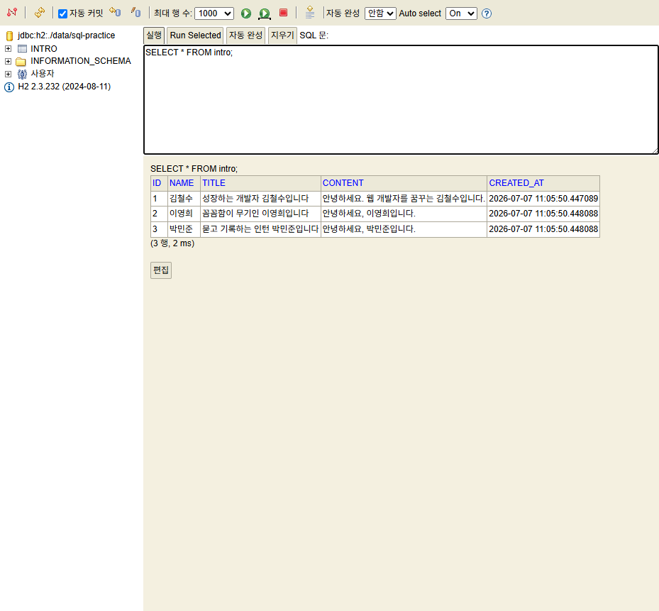

# 03. SQL 기초 — 자기소개서 테이블 직접 다뤄보기

> **이 문서에서 배우는 것**
> - 테이블을 만들고(CREATE), 데이터를 넣고(INSERT), 찾고(SELECT), 고치고(UPDATE), 지우는(DELETE) SQL
> - 조건(WHERE), 정렬(ORDER BY), 개수 세기(COUNT) 같은 조회의 기본기
> - 제약조건(NOT NULL, FK)이 실수를 어떻게 막아주는지 — 일부러 에러를 내 봅니다
> - (심화) 두 테이블을 연결해서 조회하는 JOIN 맛보기

SQL은 눈으로 읽으면 다 아는 것 같지만, **직접 쳐 보고 에러를 만나 봐야** 남습니다.
이 문서의 모든 쿼리는 [01 문서](./01_데이터베이스_기본개념.md)에서 띄운 **H2 콘솔에 직접 입력**하면서 따라오세요.

> 💡 시작 전에: H2 콘솔 접속 시 JDBC URL을 `jdbc:h2:./data/sql-practice` 로 바꿔 접속하세요.
> 새 연습장(새 DB 파일)이 만들어집니다. 실수해도 부담 없습니다 — 연습장은 지우고 다시 만들면 되니까요.

---

## 1. CREATE TABLE — 테이블 만들기

01 문서에서 그림으로 봤던 intro 테이블을 실제로 만듭니다.

```sql
CREATE TABLE intro (
    id         BIGINT AUTO_INCREMENT PRIMARY KEY,  -- 자동증가 기본키
    name       VARCHAR(50)  NOT NULL,              -- 작성자 이름 (필수)
    title      VARCHAR(200) NOT NULL,              -- 제목 (필수)
    content    VARCHAR(4000),                      -- 내용 (비어 있어도 됨)
    created_at TIMESTAMP DEFAULT CURRENT_TIMESTAMP -- 작성시각 (자동 기록)
);
```

한 줄씩 읽어 봅시다.

| 구문 | 의미 |
|---|---|
| `BIGINT AUTO_INCREMENT` | 큰 정수. 값을 안 넣으면 DB가 1, 2, 3... 자동으로 매김 |
| `PRIMARY KEY` | 이 열이 기본키(행의 주민등록번호) |
| `VARCHAR(50)` | 최대 50자의 가변 길이 문자열 |
| `NOT NULL` | 값 없이는 저장을 거부하는 **제약조건** |
| `DEFAULT CURRENT_TIMESTAMP` | 값을 안 넣으면 현재 시각을 자동으로 채움 |

> 📌 SQL 키워드(CREATE, SELECT...)는 대소문자를 구분하지 않습니다. 이 문서는 관례대로 **키워드는 대문자,
> 테이블/컬럼 이름은 소문자**로 씁니다. 문장 끝의 세미콜론(`;`)은 "문장이 끝났다"는 표시입니다.

---

## 2. INSERT — 데이터 넣기

자기소개서 3건을 등록합니다. 한 문장씩 실행해 보세요.

```sql
INSERT INTO intro (name, title, content)
VALUES ('김철수', '성장하는 개발자 김철수입니다', '안녕하세요. 웹 개발자를 꿈꾸는 김철수입니다.');

INSERT INTO intro (name, title, content)
VALUES ('이영희', '꼼꼼함이 무기인 이영희입니다', '안녕하세요, 이영희입니다.');

INSERT INTO intro (name, title, content)
VALUES ('박민준', '묻고 기록하는 인턴 박민준입니다', '안녕하세요, 박민준입니다.');
```

- 컬럼 목록에 `id`와 `created_at`이 **없다**는 점을 보세요. 자동증가와 DEFAULT가 알아서 채웁니다.
- 문자열은 작은따옴표 `'...'`로 감쌉니다. (큰따옴표 아님!)

### 🧨 일부러 에러 내보기 1 — NOT NULL 제약

제목 없이 저장을 시도하면?

```sql
INSERT INTO intro (name, content) VALUES ('오류맨', '제목 없는 글');
```

```text
NULL not allowed for column "TITLE"
```

**DB가 저장을 거부했습니다.** 이것이 제약조건의 힘입니다 — 애플리케이션에 버그가 있어도
DB가 최후의 방어선으로 데이터 품질을 지킵니다.

---

## 3. SELECT — 데이터 찾기 (가장 많이 쓰는 SQL)

### 전체 조회

```sql
SELECT * FROM intro;
```

```text
ID | NAME  | TITLE                       | CONTENT                          | CREATED_AT
1  | 김철수 | 성장하는 개발자 김철수입니다     | 안녕하세요. 웹 개발자를 꿈꾸는...    | 2026-07-07 10:57:40
2  | 이영희 | 꼼꼼함이 무기인 이영희입니다     | 안녕하세요, 이영희입니다.           | 2026-07-07 10:57:40
3  | 박민준 | 묻고 기록하는 인턴 박민준입니다  | 안녕하세요, 박민준입니다.           | 2026-07-07 10:57:40
```

H2 콘솔에서 실행하면 이런 모습입니다.



`*`는 "모든 열". 원하는 열만 골라서 볼 수도 있습니다.

```sql
SELECT name, title FROM intro;
```

### WHERE — 조건으로 골라내기

```sql
-- 이름이 정확히 일치하는 행
SELECT * FROM intro WHERE name = '김철수';

-- 비교 연산 (>=, <=, <>, ...)
SELECT id, title FROM intro WHERE id >= 2;

-- LIKE: 포함 검색. %는 "아무 글자나 0개 이상"
SELECT id, title FROM intro WHERE title LIKE '%개발자%';
```

마지막 쿼리는 제목에 "개발자"가 들어간 글만 찾습니다 — 게시판 검색 기능의 정체가 바로 이것입니다.

### ORDER BY — 정렬

```sql
-- 최신 글이 위로 (내림차순 DESC / 오름차순은 ASC가 기본)
SELECT id, name, title FROM intro ORDER BY id DESC;

-- 위에서 2건만 (목록 페이징의 원리)
SELECT id, title FROM intro ORDER BY id DESC LIMIT 2;
```

> 스프링 실습의 "목록 화면(최신순)"이 내부적으로 실행하는 SQL이 바로 `ORDER BY id DESC`입니다.

### COUNT — 개수 세기

```sql
SELECT COUNT(*) FROM intro;   -- 결과: 3
```

"전체 게시글 3건" 같은 화면 문구가 여기서 나옵니다.

---

## 4. UPDATE — 데이터 고치기

박민준 님이 제목을 바꾸고 싶다고 합니다.

```sql
UPDATE intro
SET title = '기록하는 개발자 박민준입니다'
WHERE id = 3;
```

```sql
SELECT id, title FROM intro WHERE id = 3;
-- 3 | 기록하는 개발자 박민준입니다
```

### ⚠️ 실무에서 가장 무서운 실수

```sql
UPDATE intro SET title = '기록하는 개발자 박민준입니다';   -- WHERE가 없다!
```

**WHERE를 빼먹으면 모든 행이 바뀝니다.** 3건이면 웃고 넘기지만, 운영 DB의 300만 건이면 사고입니다.
UPDATE/DELETE를 실행하기 전에 **같은 WHERE로 SELECT를 먼저 실행해서 대상을 눈으로 확인**하는 습관을 들이세요.
(권한과 트랜잭션이 이런 사고의 안전망이 됩니다 — [02 문서](./02_접속과_권한.md), [04 문서](./04_JDBC_실습.md))

---

## 5. DELETE — 데이터 지우기

```sql
DELETE FROM intro WHERE id = 3;

SELECT COUNT(*) FROM intro;   -- 결과: 2
```

UPDATE와 똑같은 주의사항: **WHERE 없는 DELETE는 테이블을 통째로 비웁니다.**

여기까지가 **CRUD**입니다 — Create(INSERT), Read(SELECT), Update, Delete.
여러분이 앞으로 만들 거의 모든 기능은 이 네 가지의 조합입니다.

---

## 6. (심화·선택) JOIN 맛보기 — 테이블을 연결해서 조회하기

01 문서에서 "자기소개서에 댓글이 달린다면 comment 테이블이 intro의 id를 참조한다"고 했습니다.
직접 만들어 봅시다.

```sql
CREATE TABLE comment (
    id       BIGINT AUTO_INCREMENT PRIMARY KEY,
    intro_id BIGINT NOT NULL,          -- 어느 자기소개서의 댓글인지 (FK)
    writer   VARCHAR(50)  NOT NULL,
    message  VARCHAR(500) NOT NULL,
    CONSTRAINT fk_comment_intro FOREIGN KEY (intro_id) REFERENCES intro(id)
);

INSERT INTO comment (intro_id, writer, message) VALUES (1, '이영희', '잘 읽었습니다!');
INSERT INTO comment (intro_id, writer, message) VALUES (1, '박민준', '화이팅입니다.');
INSERT INTO comment (intro_id, writer, message) VALUES (2, '김철수', '꼼꼼함 배우고 싶어요.');
```

댓글 목록에 "어느 글의 댓글인지 제목도 같이" 보여주고 싶다면? 두 테이블을 **JOIN**으로 연결합니다.

```sql
SELECT i.title, c.writer, c.message
FROM comment c
JOIN intro i ON c.intro_id = i.id;
```

```text
TITLE                     | WRITER | MESSAGE
성장하는 개발자 김철수입니다   | 이영희  | 잘 읽었습니다!
성장하는 개발자 김철수입니다   | 박민준  | 화이팅입니다.
꼼꼼함이 무기인 이영희입니다   | 김철수  | 꼼꼼함 배우고 싶어요.
```

`ON c.intro_id = i.id` — "comment의 intro_id와 intro의 id가 같은 행끼리 붙여라"는 뜻입니다.
`c`, `i`는 테이블에 붙인 별명(alias)입니다.

### 🧨 일부러 에러 내보기 2 — 외래키(FK) 제약

존재하지 않는 999번 글에 댓글을 달아 보면?

```sql
INSERT INTO comment (intro_id, writer, message) VALUES (999, '유령', '없는 글에 댓글');
```

```text
Referential integrity constraint violation: "FK_COMMENT_INTRO: ... FOREIGN KEY(INTRO_ID) REFERENCES ... INTRO(ID)"
```

FK 제약이 **"참조하는 글이 실제로 존재해야 한다"** 를 강제합니다. 유령 댓글이 생길 수 없는 이유입니다.

> JOIN은 여기까지만 맛봅니다. 실무 SQL의 절반은 JOIN이라 해도 과언이 아니니,
> 시간이 나면 [SQL 연습 사이트(프로그래머스 SQL 고득점 Kit 등)](https://school.programmers.co.kr/learn/challenges?tab=sql_practice_kit)에서 더 풀어 보세요.

---

## 7. 정리 — 오늘의 SQL 치트시트

| 하고 싶은 것 | SQL |
|---|---|
| 저장 | `INSERT INTO 테이블 (열...) VALUES (값...)` |
| 조회 | `SELECT 열 FROM 테이블 WHERE 조건 ORDER BY 열 DESC` |
| 수정 | `UPDATE 테이블 SET 열 = 값 WHERE 조건` ← WHERE 필수! |
| 삭제 | `DELETE FROM 테이블 WHERE 조건` ← WHERE 필수! |
| 개수 | `SELECT COUNT(*) FROM 테이블` |
| 연결 조회 | `SELECT ... FROM a JOIN b ON a.x = b.y` |

다음 문서에서는 이 SQL들을 **자바 코드에서** 실행합니다. 콘솔에 직접 치던 것을 프로그램이 대신 치게 만드는 것 — 그것이 JDBC입니다.

---

⬅️ 이전: [02. 접속과 권한](./02_접속과_권한.md) | 다음: [04. JDBC 실습](./04_JDBC_실습.md) ➡️
