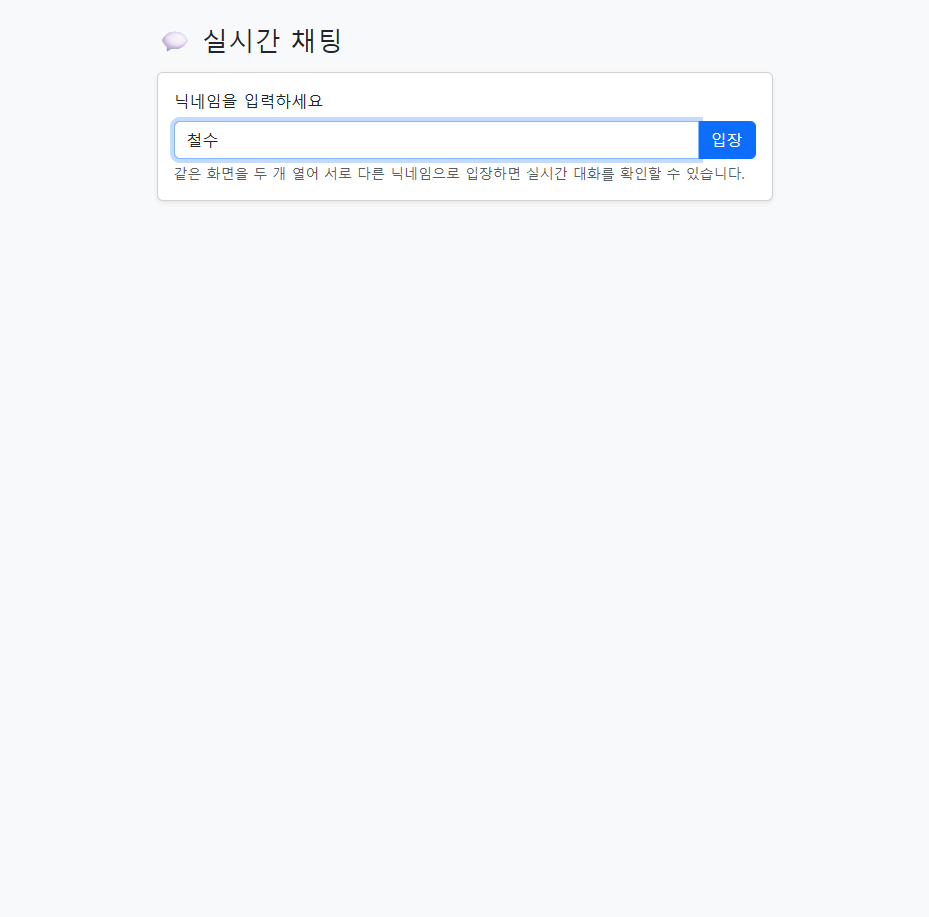
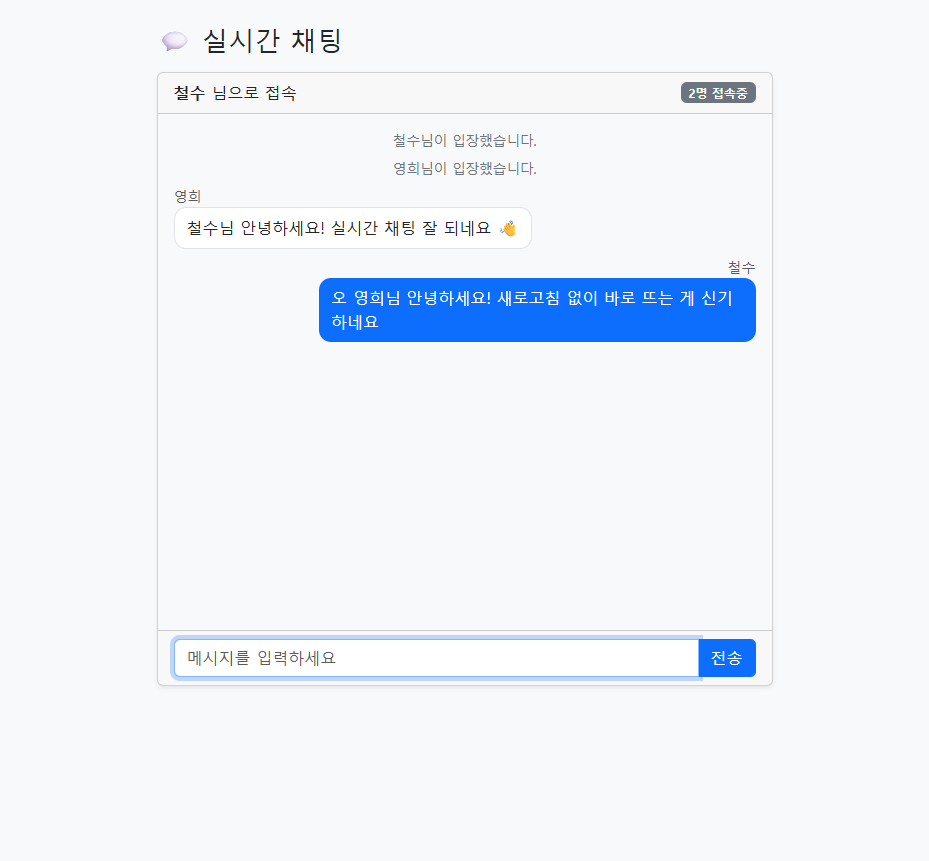
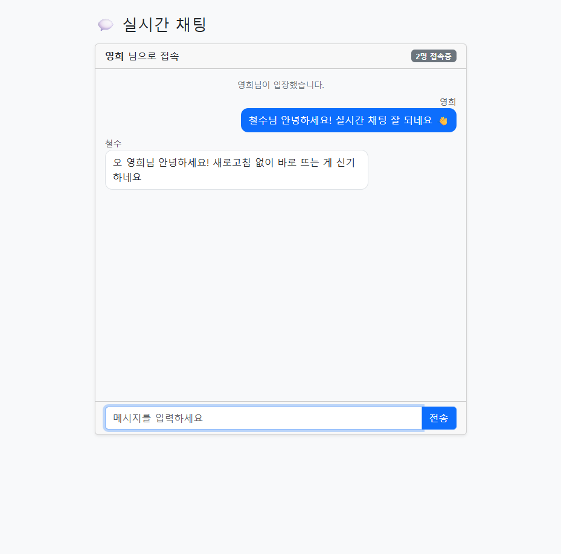

# 실시간 채팅 만들기 — 서버가 먼저 말을 거는 순간

지금까지 만든 앱(intro, weather 등)은 모두 **"브라우저가 물으면 서버가 답한다"** 는 한 방향이었습니다.
브라우저가 요청을 보내야만 서버가 응답했고, 응답이 끝나면 연결은 곧바로 끊겼죠. (HTTP)

이번 모듈에서는 그 규칙이 깨집니다. **서버가 브라우저에게 먼저 말을 겁니다.**
누군가 채팅을 치면, 내가 아무 요청도 하지 않았는데 내 화면에 그 메시지가 **저절로 뜹니다.**
이것을 가능하게 하는 기술이 **WebSocket** 입니다.

> 결론부터: 실시간 채팅의 핵심은 어렵지 않습니다. **"연결을 끊지 않고 계속 열어 둔 통로"** 하나만
> 이해하면 됩니다. 그 통로로 한 명이 보낸 메시지를 **접속한 모두에게 그대로 뿌리면(브로드캐스트)**,
> 그게 곧 그룹 채팅입니다.

| 지금까지 (HTTP) | 이번 모듈 (WebSocket) |
|---|---|
| 브라우저가 **물어야** 서버가 답함 | 서버가 **먼저** 말을 걸 수 있음 |
| 요청 1번 → 응답 1번 → **연결 끊김** | 한 번 연결하면 **계속 열려 있음** |
| "새로고침해야 새 글이 보임" | "가만히 있어도 새 메시지가 뜬다" |
| `@GetMapping`, `@PostMapping` | `WebSocketHandler` (연결/메시지/종료) |

---

## 무엇을 만드나

**닉네임을 입력하고 들어가면, 접속한 사람들끼리 실시간으로 대화하는 채팅방.**
DB도 로그인도 없이, WebSocket의 원리만으로 동작하는 가장 단순한 형태입니다.

| 입장 화면 | 실시간 대화 (철수 화면) | 상대 화면 (영희 화면) |
|---|---|---|
|  |  |  |

내부 동작을 한 장으로 요약하면 이렇습니다.

```
[철수 브라우저] ──┐                                  ┌── 열린 통로 ──▶ [철수 화면에 표시]
                  │                                  │
                  ├─▶ [스프링부트 서버]  ──브로드캐스트──┤
                  │   (접속자 목록을 들고 있다가          │
[영희 브라우저] ──┘    한 명의 말을 전원에게 복사해 전송)  └── 열린 통로 ──▶ [영희 화면에 표시]

철수가 "안녕"을 치면 → 서버가 접속자 전원(철수 포함)에게 "안녕"을 그대로 흘려보냄 → 모두의 화면에 즉시 등장
```

---

## 학습 순서

| 순서 | 문서 | 내용 | 예상 소요 |
|---|---|---|---|
| 1 | [01. 실시간 통신이란](./01_실시간_통신이란.md) | HTTP만으로는 왜 실시간이 안 되는지, 폴링 vs WebSocket, 핸드셰이크 원리 | 반나절 |
| 2 | [02. 스프링부트로 채팅 구현하기](./02_스프링부트로_채팅_구현하기.md) | 코드 한 줄씩: 설정·핸들러·메시지(DTO)·프론트엔드, 입장/대화/퇴장 흐름 | 1일 |
| 3 | [03. 한 걸음 더 — STOMP와 실무 고려사항](./03_한걸음_더_STOMP와_실무.md) | 채팅방 여러 개, 메시지 저장, 인증, 서버 여러 대로 확장, STOMP 방식 | 1일 |

---

## 시작 전 준비물

1. **[스프링부트 교육](../../Spring/SpringBoot/README.md) 완주** — 컨트롤러/서비스 3계층 구조와,
   서버가 `@Component`/`@Configuration` 빈을 주입하는 방식을 안다고 가정합니다.
2. **JavaScript 기본기** — [01_HTML_CSS_JS](../../01_HTML_CSS_JS/) 에서 배운 이벤트·JSON·`fetch` 수준.
   WebSocket은 `fetch`의 사촌쯤으로 생각하면 됩니다.
3. **JDK 17 이상** — `java -version` 으로 확인.

> ⚠️ 이 앱에는 **DB가 없습니다.** build.gradle에 JPA·H2가 하나도 없습니다.
> 채팅 메시지를 "저장하지 않고 그 순간 접속자에게 흘려보내기만" 하기 때문입니다.
> (메시지를 DB에 남기는 방법은 03 문서에서 설명합니다.)

---

## 완성 샘플 실행 방법

```powershell
cd 샘플\chat
.\gradlew.bat bootRun
```

1. 브라우저에서 **`http://localhost:8080`** 접속 → 닉네임(예: `철수`) 입력 → 입장.
2. **같은 주소를 새 탭(또는 새 창)으로 하나 더 열고** 다른 닉네임(예: `영희`)으로 입장.
3. 한쪽에서 메시지를 보내면 **양쪽 화면에 동시에** 뜨는 것을 확인하세요. (이게 실시간)
4. 한쪽 탭을 닫으면 다른 쪽에 **"○○님이 나갔습니다"** 가 뜹니다.

종료는 콘솔에서 `Ctrl + C`.

> 📌 **혼자서도 테스트됩니다.** 탭 2개를 서로 다른 닉네임으로 열면 두 사람인 것처럼 대화할 수 있습니다.

---

## 프로젝트 구조 (샘플/chat)

```
샘플/chat
├─ build.gradle                         ← 의존성은 websocket 스타터 하나뿐 (DB 없음)
└─ src/main
   ├─ java/com/example/chat
   │  ├─ ChatApplication.java            ← 앱 시작점 (기존과 동일)
   │  ├─ config/WebSocketConfig.java     ← "어떤 주소를 어떤 핸들러에 연결할지" 등록
   │  ├─ handler/ChatWebSocketHandler.java ← 연결/메시지/종료를 처리하는 채팅의 심장
   │  └─ dto/ChatMessage.java            ← 오가는 메시지 한 건의 모양(JSON ↔ 자바)
   └─ resources
      ├─ application.properties          ← 포트 등 설정
      └─ static/index.html               ← 브라우저 채팅 화면 (내장 WebSocket 사용)
```

지금까지의 `컨트롤러 → 서비스 → 리포지토리` 구조와 비교하면, 이번엔 **`설정(Config) → 핸들러(Handler)`** 2개가
핵심입니다. HTTP 주소를 매핑하던 자리에 "WebSocket 주소 매핑"이, 요청을 처리하던 자리에 "핸들러"가 들어왔을 뿐입니다.

---

## 🏢 회사 실무(eGovFrame)와의 연결

- 회사 표준인 **eGovFrame(Spring MVC)** 도 결국 같은 스프링 위에 있습니다. WebSocket은
  `spring-websocket` 모듈이 담당하는데, 이는 부트든 레거시 MVC든 **동일하게** 쓸 수 있습니다.
- 실무에서 실시간 기능(알림, 대시보드 자동 갱신, 관제 화면, 1:1 상담 채팅)이 필요할 때 이 기술을 씁니다.
- 다만 **규모가 있는 실서비스는 원시 WebSocket보다 STOMP + 메시지 브로커**(03 문서)를 얹는 경우가
  많습니다. 이 모듈은 그 밑바탕이 되는 "원리"를 먼저 손에 익히는 것이 목표입니다.

---

## 이 모듈이 끝나면

- HTTP와 WebSocket의 **차이와 각각의 쓸 자리**를 설명할 수 있습니다.
- 스프링부트에서 `WebSocketHandler`로 **연결·메시지·종료** 3가지 사건을 처리할 수 있습니다.
- 한 명의 메시지를 전원에게 **브로드캐스트**하는 그룹 채팅의 원리를 압니다.
- 브라우저 내장 `WebSocket` API로 **프레임워크 없이** 실시간 클라이언트를 만들 수 있습니다.
- 실무로 확장할 때 무엇을 더 고민해야 하는지(**저장·인증·확장·보안**) 감을 잡습니다.

---

다음 → [01. 실시간 통신이란](./01_실시간_통신이란.md)
