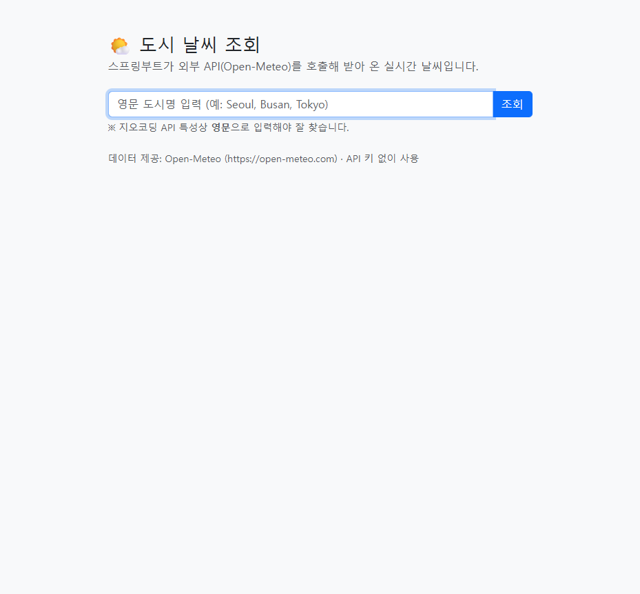
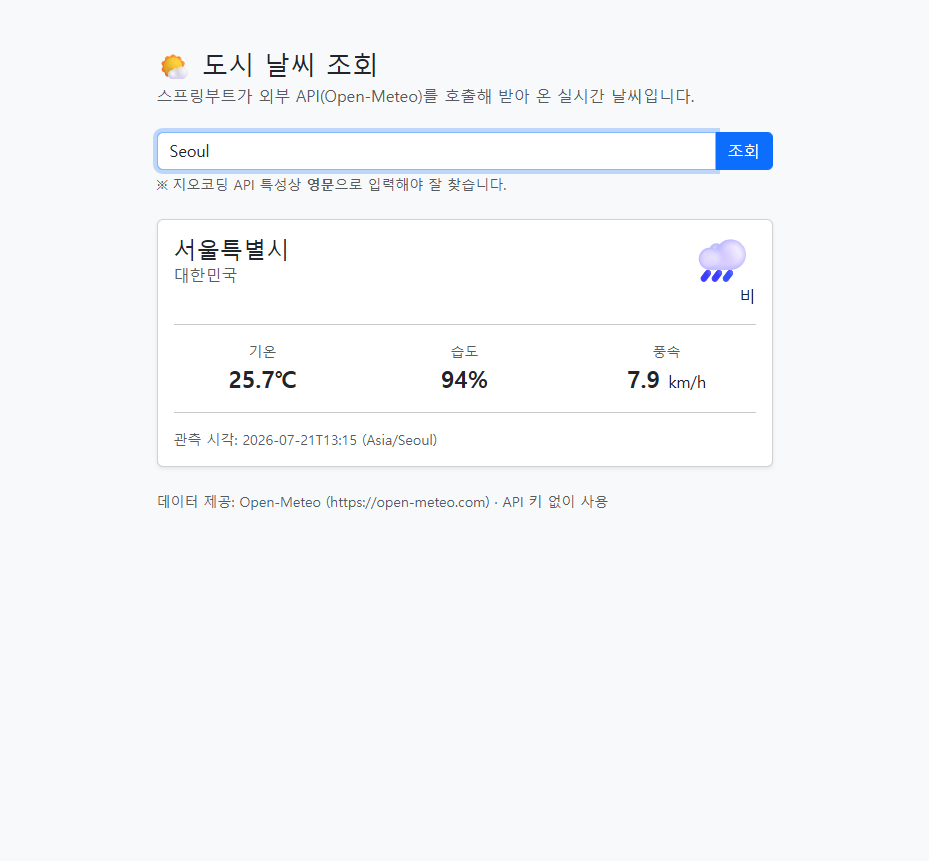
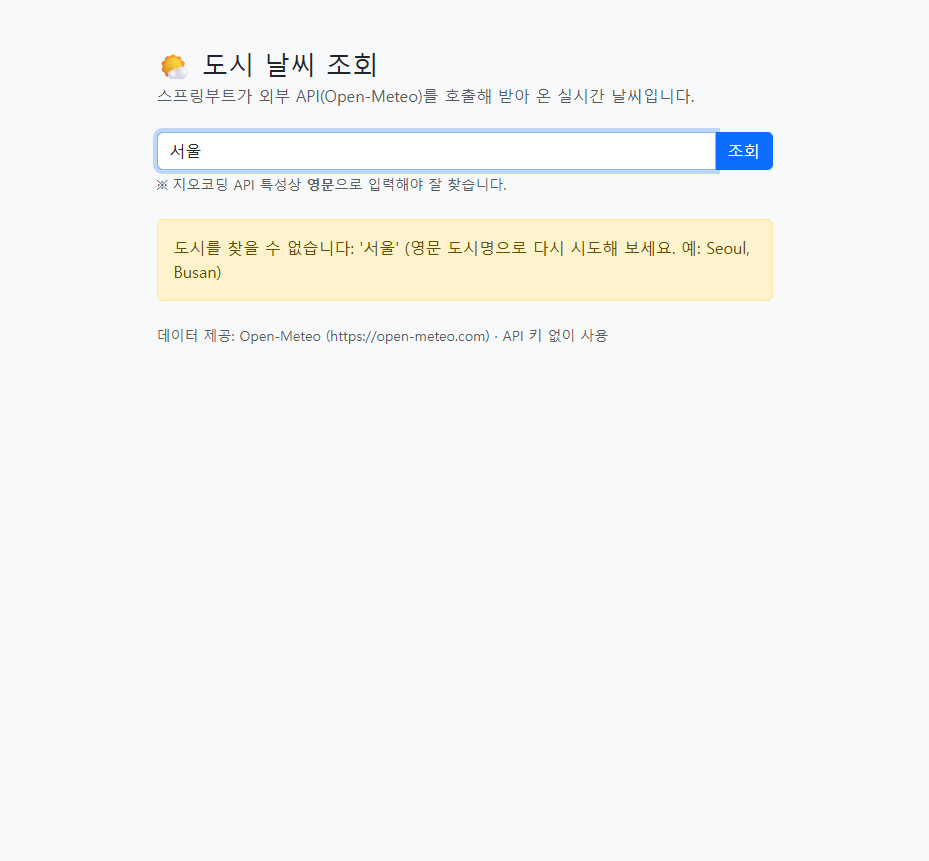

# 외부 API 호출하기 — 스프링부트가 "손님"이 되는 순간

지금까지 만든 앱(intro, intro-jpa, intro-api)에서 스프링부트는 항상 **요청을 받는 쪽(서버)** 이었습니다.
브라우저나 React가 요청을 보내면, 우리 서버가 응답을 돌려줬죠.

이번 모듈에서는 **입장이 뒤바뀝니다.** 스프링부트가 남의 서버(외부 API)에
**요청을 보내는 쪽(클라이언트)** 이 됩니다.

- 우리 앱 → **날씨 API(Open-Meteo)** 에 "서울 날씨 알려줘" 라고 요청
- 받아 온 데이터를 우리 화면(Thymeleaf)에 예쁘게 그려서 보여 줌

> 실무에서 이건 **매일 하는 일**입니다. 결제(PG사), 지도(카카오/네이버), 문자·알림톡,
> 공공데이터(data.go.kr), 환율·주가, 로그인(소셜 OAuth)… 대부분 남이 만든 API를 갖다 씁니다.
> "혼자 다 만드는 앱"은 거의 없습니다.

| 지금까지 (intro-api) | 이번 모듈 (weather) |
|---|---|
| 우리 서버가 **응답하는** 쪽 | 우리 서버가 **요청하는** 쪽 |
| `@RestController` 로 JSON을 **내보냄** | `RestClient` 로 JSON을 **받아옴** |
| DB(H2/MySQL)에서 데이터를 꺼냄 | **외부 API**에서 데이터를 꺼냄 |
| 컨트롤러 → 서비스 → 리포지토리 | 컨트롤러 → 서비스 → **클라이언트(RestClient)** |

`리포지토리(DB)` 자리에 `클라이언트(외부 API)` 가 들어왔을 뿐, **나머지 구조는 똑같습니다.**
그래서 이번 모듈은 어렵지 않습니다 — "데이터를 어디서 가져오냐"만 바뀝니다.

---

## 무엇을 만드나

**도시 이름을 입력하면 현재 날씨를 보여 주는 앱.** API 키가 필요 없어서 바로 실행됩니다.

| 검색 폼 | 결과 카드 | 에러 처리 |
|---|---|---|
|  |  |  |

내부적으로는 외부 API를 **두 번** 호출합니다 (실무에서 흔한 "호출 이어붙이기"):

```
"Seoul" 입력
   │
   ├─ ① 지오코딩 API 호출:  "Seoul" → 위도 37.57, 경도 126.98   (도시명은 좌표를 모름)
   │
   └─ ② 날씨 API 호출:      위도·경도 → 기온 25.7℃, 습도 94%, 날씨코드 63(비)
                                                      │
                                                      └─ 화면에 카드로 표시
```

---

## 학습 순서

| 순서 | 문서 | 내용 | 예상 소요 |
|---|---|---|---|
| 1 | [01. 외부 API 호출이란](./01_외부API_호출이란.md) | 서버가 클라이언트가 된다는 것, HTTP 클라이언트 3형제(RestClient/RestTemplate/WebClient) | 반나절 |
| 2 | [02. RestClient로 날씨 불러오기](./02_RestClient로_날씨_불러오기.md) | 코드 한 줄씩: 설정·DTO·클라이언트·서비스·화면, JSON → 자바 객체 변환 | 1일 |
| 3 | [03. 에러 처리와 실무 고려사항](./03_에러처리와_실무_고려사항.md) | 타임아웃·재시도·예외, **API 키 안전하게 다루기**, 공공데이터포털 연동법 | 1일 |

---

## 시작 전 준비물

1. **[스프링부트 4 + JPA 교육](../Database/README.md) 또는 [Front-Back 교육](../Front-Back/README.md) 완주** —
   컨트롤러/서비스 3계층 구조와 JSON(DTO) 개념을 안다고 가정합니다.
2. **JDK 17 이상** — `java -version` 으로 확인.
3. **인터넷 연결** — 외부 API를 실제로 부르므로 사내망 방화벽이 `api.open-meteo.com` 을
   막고 있지 않아야 합니다. (막혀 있으면 03 문서의 "프록시" 항목 참고)

> ⚠️ 이 앱에는 **DB가 없습니다.** build.gradle에 JPA·H2가 하나도 없다는 점을 눈여겨보세요.
> 데이터를 외부에서 가져오므로 우리 DB가 필요 없습니다.

---

## 완성 샘플 실행 방법

```powershell
cd 샘플/weather
.\gradlew.bat bootRun
```

브라우저에서 **`http://localhost:8080`** 접속 → 영문 도시명(예: `Seoul`, `Busan`, `Tokyo`) 입력 → 조회.
종료는 콘솔에서 `Ctrl + C`.

> ⚠️ **도시명은 영문으로.** 지오코딩 API가 한글 검색("서울")을 잘 못 찾습니다.
> "Seoul"로 넣으면 결과 이름은 "서울특별시"로 한글로 돌아옵니다. (자세한 원인은 02 문서)

---

## 이 모듈이 끝나면

- 스프링부트에서 **외부 API를 호출**(RestClient)하고, 받은 JSON을 자바 객체로 변환할 수 있습니다.
- 필요한 필드만 담은 **DTO 설계**와 `@JsonIgnoreProperties`, `@JsonProperty` 의 역할을 압니다.
- 외부 호출이 실패할 때(없는 값, 타임아웃, 상대 서버 장애)를 **구분해서 처리**할 수 있습니다.
- **API 키를 코드에 박지 않고** 환경변수/설정으로 안전하게 다루는 실무 습관을 익힙니다.
- 회사에서 실제로 쓰는 **공공데이터포털(data.go.kr)** 같은 키 기반 API로 확장할 수 있습니다.
