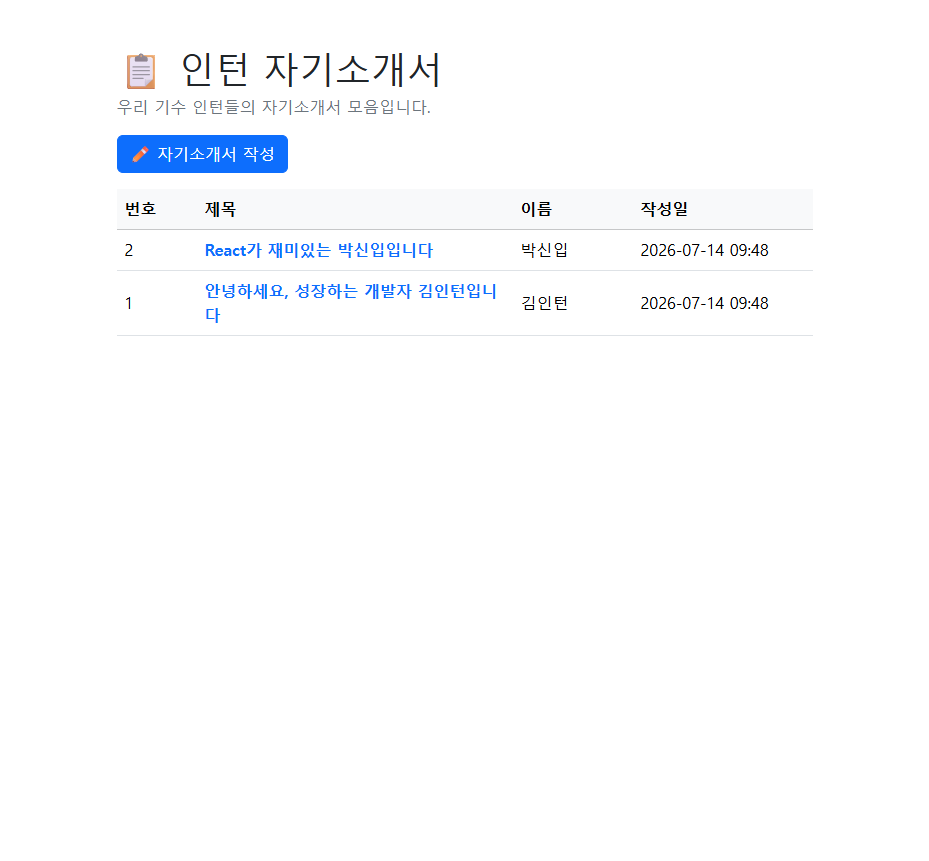
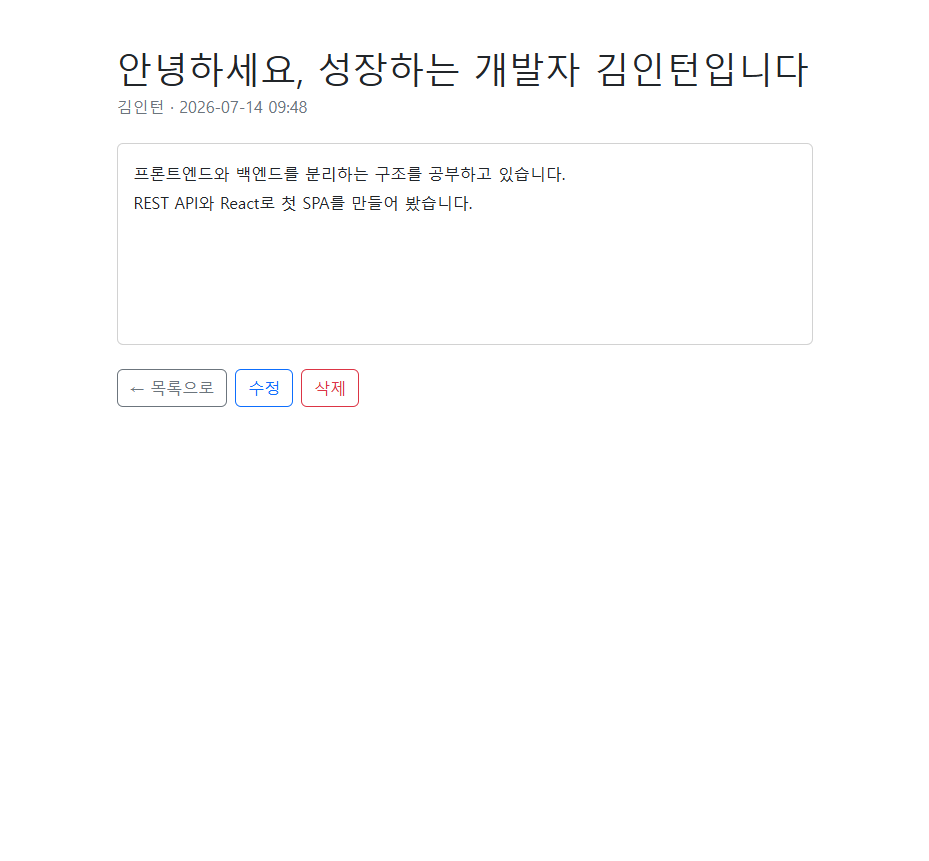

# 프론트엔드 / 백엔드 분리 — 같은 앱을 React + REST API로

[스프링부트 4 + JPA 교육](../Database/README.md)에서 완성한 자기소개서 앱(intro-jpa)은
서버가 HTML 화면까지 만들어 주는 구조였습니다. 이번 모듈에서는 **똑같은 앱을 둘로 쪼갭니다.**

- **백엔드(intro-api)** — 스프링부트. 화면 없이 **데이터(JSON)만** 응답하는 REST API 서버
- **프론트엔드(intro-react)** — React. 브라우저에서 API를 호출해 **화면을 그리는** 앱

기능은 완전히 같습니다(자기소개서 CRUD). 그런데 구조를 나누는 순간
**REST API, JSON, CORS, SPA, 컴포넌트** 같은 현대 웹 개발의 핵심 개념이 전부 등장합니다.
요즘 웹 서비스 대부분이 이 구조로 만들어지고 있어서, 한 번 직접 겪어 보는 것이 목표입니다.

| 지금까지 (intro-jpa) | 이번 모듈 (intro-api + intro-react) |
|---|---|
| 서버 1개가 데이터 + 화면 모두 담당 | 서버(데이터)와 프론트(화면) 분리 |
| 요청마다 완성된 HTML을 응답 | 데이터(JSON)만 응답, 화면은 브라우저가 조립 |
| 화면 이동 = 페이지 새로 받기 | 페이지 이동 없이 JS가 화면 교체 (SPA) |

---

## 학습 순서

| 순서 | 문서 | 내용 | 예상 소요 |
|---|---|---|---|
| 1 | [01. 왜 프론트와 백엔드를 나눌까](./01_왜_프론트와_백엔드를_나눌까.md) | 서버 렌더링 vs 분리 구조, 장단점, 실무 맥락 | 반나절 |
| 2 | [02. REST API 기본 개념](./02_REST_API_기본개념.md) | HTTP 메서드·상태 코드·JSON, intro-jpa를 REST API로 바꾸기 | 1일 |
| 3 | [03. React 시작하기](./03_React_시작하기.md) | Node.js/npm, 프로젝트 생성, JSX·컴포넌트·props·state | 1일 |
| 4 | [04. React로 CRUD 화면 만들기](./04_React로_CRUD_화면_만들기.md) | fetch로 API 호출, useEffect, CORS, 자기소개서 화면 완성 | 1~2일 |

---

## 시작 전 준비물

1. **[스프링부트 4 + JPA 교육](../Database/README.md) 완주** — intro-jpa의 구조
   (컨트롤러/서비스/리포지토리, H2)를 안다고 가정합니다.
2. **JDK 17 이상** — `java -version`으로 확인.
3. **Node.js LTS** — React 개발 도구를 돌리는 데 필요합니다. 설치는 03 문서에서 안내합니다.
   (이 자료는 Node.js 22 / npm 11 기준으로 검증했습니다.)

---

## 완성 샘플 프로젝트

**실행 가능한 완성본** 두 개가 들어 있습니다. (CRUD 전 기능을 브라우저에서 검증 완료)

| 폴더 | 내용 |
|---|---|
| [샘플/intro-api](./샘플/intro-api/) | 백엔드 — intro-jpa에서 화면(Thymeleaf)을 떼어내고 REST API로 바꾼 것 |
| [샘플/intro-react](./샘플/intro-react/) | 프론트엔드 — React(Vite). 모든 파일에 학습용 주석이 달려 있습니다 |

### 실행 방법 — 터미널 2개가 필요합니다!

이제 서버가 둘이라서 **각각 따로 켜야 합니다.** 이것부터가 "분리"의 체험입니다.

```powershell
# 터미널 1 — 백엔드 (8080 포트)
cd 샘플/intro-api
.\gradlew.bat bootRun
```

```powershell
# 터미널 2 — 프론트엔드 (5173 포트)
cd 샘플/intro-react
npm install     # 최초 1회만 (라이브러리 내려받기)
npm run dev
```

브라우저에서 **`http://localhost:5173`** 접속 (8080이 아닙니다! 8080은 데이터만 주는 서버).
종료는 각 콘솔에서 `Ctrl + C`.

| 목록 화면 | 상세 화면 |
|---|---|
|  |  |

화면이 intro-jpa와 똑같아 보인다면 성공입니다 — **겉모습은 같지만 만들어지는 곳이
서버에서 브라우저로 바뀌었습니다.**

---

## 이 모듈이 끝나면

- 프론트/백 분리 구조의 **장점과 비용**을 설명하고, 어떤 경우에 적합한지 판단할 수 있습니다.
- **REST API를 설계**하고(@RestController, URL/메서드/상태 코드), 브라우저 개발자 도구로 JSON 통신을 확인할 수 있습니다.
- **React의 기본 원리**(컴포넌트, props, state, 렌더링)를 이해하고 화면을 만들 수 있습니다.
- 분리 구조에서 반드시 만나는 **CORS 에러**의 원인과 해결 방법을 압니다.
- 회사 실무(eGovFrame, JSP 서버 렌더링)와 최신 구조(SPA + API)를 **같은 선 위에서** 비교할 수 있습니다.
