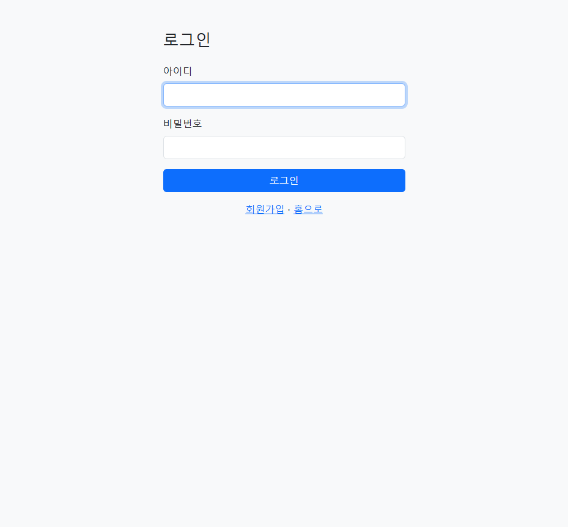
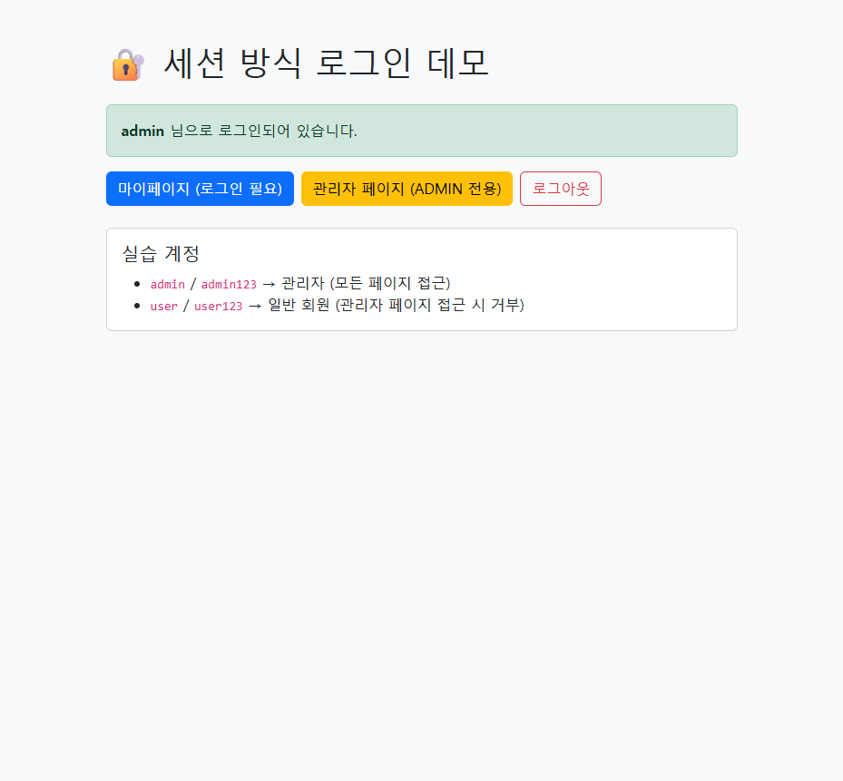

# 02. 세션 방식 로그인 — auth-session 만들기

> **이 문서에서 배우는 것**
> - **세션(session)과 쿠키(cookie)** 로 로그인 상태를 유지하는 원리
> - Spring Security의 **폼 로그인(formLogin)** 설정
> - 권한(USER/ADMIN)별 접근 제어
> - **CSRF** 가 무엇이고 왜 폼에 숨은 값이 들어가는지
> - 완성본: [샘플/auth-session](./샘플/auth-session/)

---

## 1. 세션 방식의 원리 — "서버가 기억한다"

세션 방식의 핵심은 **로그인 상태를 서버가 기억한다**는 것입니다.

```
1. [브라우저] 아이디/비밀번호로 로그인 요청
2. [서버]     확인 OK → 세션(=로그인 상태 메모지)을 서버 메모리에 만들고,
              그 메모지의 번호(세션 ID)를 쿠키로 내려 줌
              ⇒ 응답 헤더: Set-Cookie: JSESSIONID=ABC123...
3. [브라우저] 이후 모든 요청에 이 쿠키를 자동으로 붙여 보냄
              ⇒ 요청 헤더: Cookie: JSESSIONID=ABC123...
4. [서버]     쿠키의 세션 ID로 "아, ABC123은 admin이구나" 하고 알아봄
```

- **세션(Session)**: 서버가 사용자별로 들고 있는 "로그인 상태 메모지". 서버 메모리에 저장됩니다.
- **쿠키(Cookie)**: 브라우저가 보관하는 작은 값. 세션 방식에서는 **세션 ID(JSESSIONID)** 를 담습니다.
- 브라우저가 쿠키를 **자동으로** 붙여 주기 때문에, 로그인 후에는 우리가 신경 쓸 것이 없습니다.

> 💡 이 방식은 **서버가 상태를 가진다(stateful)** 고 표현합니다. 서버가 재시작되거나 여러 대로 늘어나면
> "누가 로그인했는지"를 공유해야 하는 문제가 생기는데, 이 한계가 바로 JWT(03 문서)의 출발점입니다.

---

## 2. 프로젝트 만들기

[start.spring.io](https://start.spring.io) 에서 아래 의존성으로 새 프로젝트를 만들거나,
완성본 [샘플/auth-session](./샘플/auth-session/) 을 그대로 열어도 됩니다.

- **Spring Security**, **Spring Web(webmvc)**, **Thymeleaf**, **Spring Data JPA**, **H2 Database**

`build.gradle` 의 핵심 부분:

```gradle
dependencies {
    implementation 'org.springframework.boot:spring-boot-starter-security'
    implementation 'org.springframework.boot:spring-boot-starter-webmvc'
    implementation 'org.springframework.boot:spring-boot-starter-thymeleaf'
    implementation 'org.springframework.boot:spring-boot-starter-data-jpa'
    implementation 'org.springframework.boot:spring-boot-h2console'
    runtimeOnly   'com.h2database:h2'
}
```

> 💡 **DB는 인메모리 H2** 를 씁니다(`jdbc:h2:mem:authdb`). 인증 데모라서 데이터를 파일로 남길 필요가 없어,
> 앱을 끄면 사라지고 켜면 `DataInitializer` 가 실습 계정을 다시 넣습니다.

---

## 3. 회원 저장 준비 — 엔티티 · 리포지토리

회원을 DB에 저장할 `Member` 엔티티입니다. **비밀번호 컬럼에는 해시값만** 들어갑니다.

```java
@Entity
public class Member {
    @Id @GeneratedValue(strategy = GenerationType.IDENTITY)
    private Long id;
    @Column(nullable = false, unique = true) private String username; // 로그인 아이디
    @Column(nullable = false) private String password;                // BCrypt 해시
    @Column(nullable = false) private String displayName;             // 표시 이름
    @Enumerated(EnumType.STRING) private Role role;                   // USER / ADMIN
    // 생성자·getter 생략 (샘플 코드 참고)
}
```

리포지토리는 아이디로 회원을 찾는 메서드만 있으면 됩니다.

```java
public interface MemberRepository extends JpaRepository<Member, Long> {
    Optional<Member> findByUsername(String username);
    boolean existsByUsername(String username);
}
```

---

## 4. DB와 Security 잇기 — `CustomUserDetailsService`

로그인 시 Security가 호출하는 다리입니다. (개념은 [01 문서 4절](./01_스프링_시큐리티_기초.md) 참고)

```java
@Service
public class CustomUserDetailsService implements UserDetailsService {
    private final MemberRepository memberRepository;
    // 생성자 생략

    @Override
    public UserDetails loadUserByUsername(String username) {
        Member m = memberRepository.findByUsername(username)
                .orElseThrow(() -> new UsernameNotFoundException("없는 회원: " + username));
        return User.builder()
                .username(m.getUsername())
                .password(m.getPassword())
                .authorities(new SimpleGrantedAuthority("ROLE_" + m.getRole().name()))
                .build();
    }
}
```

---

## 5. 보안 규칙 — `SecurityConfig`

세션 방식의 핵심 설정입니다. **폼 로그인**과 **URL별 권한**을 선언합니다.

```java
@Configuration
public class SecurityConfig {

    @Bean
    public PasswordEncoder passwordEncoder() {
        return new BCryptPasswordEncoder();
    }

    @Bean
    public SecurityFilterChain filterChain(HttpSecurity http) throws Exception {
        http
            .authorizeHttpRequests(auth -> auth
                .requestMatchers("/", "/login", "/signup", "/css/**", "/h2-console/**").permitAll()
                .requestMatchers("/admin", "/admin/**").hasRole("ADMIN")
                .anyRequest().authenticated()
            )
            .formLogin(form -> form
                .loginPage("/login")            // 우리가 만든 로그인 화면
                .loginProcessingUrl("/login")   // 이 주소로 POST 되면 Security가 로그인 처리
                .defaultSuccessUrl("/", true)   // 성공 시 홈으로
                .failureUrl("/login?error")     // 실패 시
                .permitAll()
            )
            .logout(logout -> logout
                .logoutUrl("/logout")
                .logoutSuccessUrl("/?logout")
                .permitAll()
            );
        return http.build();
    }
}
```

**여기서 놀라운 점**: 우리는 로그인 화면(HTML)만 만들고, 실제 **아이디/비밀번호 검증과 세션 생성은
한 줄도 짜지 않았습니다.** `formLogin` 설정만으로 Security가 다 해 줍니다.
우리가 준비한 건 `CustomUserDetailsService`(회원 찾기)와 `PasswordEncoder`(비교 방법)뿐입니다.

> ⚠️ **로그인 폼의 `name` 은 반드시 `username` / `password`**
> Security의 폼 로그인 필터는 이 두 이름의 값을 찾습니다. HTML `<input name="...">` 를
> 다른 이름으로 바꾸면 로그인이 동작하지 않습니다. (바꾸려면 `.usernameParameter(...)` 로 별도 설정)

---

## 6. 로그인 화면과 CSRF

로그인 페이지(`templates/login.html`)의 핵심은 이 폼입니다.

```html
<form th:action="@{/login}" method="post">
    <input type="text"     name="username" required>
    <input type="password" name="password" required>
    <button type="submit">로그인</button>
</form>
```

`method="post"` 로 `/login` 에 보내면 5절의 `loginProcessingUrl` 이 받아 처리합니다.

### CSRF 토큰은 어디에?

Spring Security는 기본적으로 **CSRF 보호**를 켭니다. 그래서 POST 요청에는 **CSRF 토큰**이라는
숨은 값이 반드시 있어야 하는데, 위 HTML에는 그런 게 안 보입니다. 왜 동작할까요?

> 💡 **타임리프의 `th:action` 을 쓰면 CSRF 토큰이 자동으로 삽입됩니다.**
> Security가 등록한 처리기가 폼에 `<input type="hidden" name="_csrf" value="...">` 를 몰래 넣어 줍니다.
> 브라우저에서 "페이지 소스 보기"를 하면 실제로 숨은 `_csrf` 필드를 확인할 수 있습니다.

**CSRF(사이트 간 요청 위조)** 란, 로그인된 당신의 브라우저를 이용해 악성 사이트가 몰래
"글 삭제" 같은 요청을 보내는 공격입니다. CSRF 토큰은 "이 요청이 우리 사이트의 정상 폼에서
나왔다"는 증표라서, 토큰을 모르는 외부 사이트는 위조할 수 없습니다.

> ⚠️ **로그아웃도 POST 입니다.**
> CSRF 보호 때문에 로그아웃은 링크(GET)가 아니라 **POST 폼**으로 보내야 합니다.
> ```html
> <form th:action="@{/logout}" method="post">
>     <button type="submit">로그아웃</button>
> </form>
> ```

---

## 7. 실습 계정 넣기 — `DataInitializer`

앱 시작 시 실습 계정 2개를 넣습니다. **비밀번호는 반드시 인코딩해서** 저장합니다.

```java
memberRepository.save(new Member("admin", passwordEncoder.encode("admin123"), "관리자", Role.ADMIN));
memberRepository.save(new Member("user",  passwordEncoder.encode("user123"),  "일반회원", Role.USER));
```

---

## 8. 실행하고 눈으로 확인하기

```bash
cd Spring/Security/샘플/auth-session
./gradlew bootRun
```

브라우저에서 http://localhost:8080 접속 후:

1. **로그인 안 한 상태**에서 "마이페이지" 클릭 → 자동으로 **로그인 페이지로 이동**(접근 차단됨)
2. `user` / `user123` 로그인 → 홈에 "user 님으로 로그인" 표시, 마이페이지 접근 OK
3. 로그인한 채로 "관리자 페이지" 클릭 → **`403` 접근 거부**(USER라서 권한 없음)
4. 로그아웃 후 `admin` / `admin123` 로그인 → 관리자 페이지까지 **접근 성공**




### 개발자 도구로 쿠키 확인

브라우저 개발자 도구(F12) → **Application(또는 저장소) → Cookies** 에서 `JSESSIONID` 를 확인하세요.
이 값이 바로 "서버가 나를 기억하는 번호"입니다. 이 쿠키를 지우면 로그아웃과 같은 상태가 됩니다.

> 💡 **회원 테이블 들여다보기**: http://localhost:8080/h2-console 에서 JDBC URL 에 `jdbc:h2:mem:authdb`
> 를 넣고 접속하면 `MEMBER` 테이블을 볼 수 있습니다. `password` 컬럼이 `$2a$...` 로 시작하는
> **해시값**이라는 걸 직접 확인해 보세요. 원문 비밀번호는 어디에도 없습니다.

---

## 정리

- 세션 방식은 **서버가 로그인 상태를 기억**하고, 브라우저는 **세션 쿠키(JSESSIONID)** 로 신분을 증명합니다.
- `formLogin` 설정만으로 로그인 처리·세션 생성이 자동입니다. 우리는 화면과 `UserDetailsService` 만 준비합니다.
- 쿠키를 쓰므로 **CSRF 보호**가 함께 갑니다. 타임리프 `th:action` 이 토큰을 자동 삽입합니다.

이제 정반대 접근인 **[03. JWT 토큰 방식](./03_JWT_토큰_방식.md)** — "서버가 아무 것도 기억하지 않는" 방식으로 갑니다.
