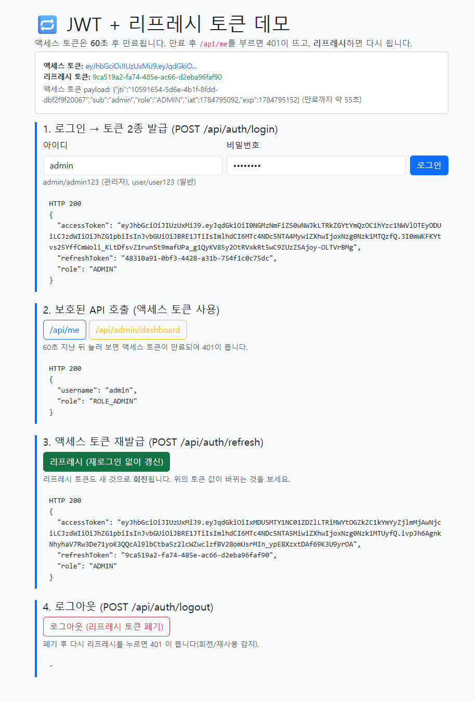

# 스프링 시큐리티 — 세션 방식과 JWT 토큰 방식으로 로그인 만들기

지금까지 만든 앱들은 **누구나** 접근할 수 있었습니다. 이번 모듈에서는 웹 서비스의 필수 기능인
**로그인(인증)** 과 **권한 관리(인가)** 를 **Spring Security** 로 붙여 봅니다.

로그인을 구현하는 방식은 크게 두 가지입니다. 이 모듈은 **같은 기능을 두 방식으로 각각** 만들어
차이를 몸으로 느끼게 합니다.

| 방식 | 한 줄 설명 | 주로 쓰는 곳 |
|---|---|---|
| **세션(Session)** | 서버가 로그인 상태를 "기억"하고, 브라우저는 세션 쿠키를 가지고 다님 | 서버가 화면까지 그리는 전통적 웹 (JSP/타임리프) — **회사 eGovFrame 방식** |
| **JWT 토큰** | 서버는 아무 것도 기억하지 않고, 클라이언트가 "서명된 토큰"으로 매번 신분 증명 | 프론트/백 분리, 모바일 앱, 여러 서버로 확장되는 API |

> 💡 **결론부터**: 정답은 없습니다. **화면까지 서버가 그리면 세션**, **API만 제공하면 JWT** 가 기본값입니다.
> 자세한 판단 기준은 [04. 세션 vs JWT](./04_세션_vs_JWT_비교.md)에서 표로 정리합니다.

---

## 학습 순서

| 순서 | 문서 | 내용 | 예상 소요 |
|---|---|---|---|
| 1 | [01. 스프링 시큐리티 기초](./01_스프링_시큐리티_기초.md) | 인증과 인가, 시큐리티 필터체인, `SecurityFilterChain`·`PasswordEncoder`·`UserDetailsService`, 비밀번호 암호화 | 반나절 |
| 2 | [02. 세션 방식 로그인](./02_세션_방식_로그인.md) | 세션·쿠키 원리, 폼 로그인, 권한별 접근 제어, CSRF — 샘플 **auth-session** | 1일 |
| 3 | [03. JWT 토큰 방식](./03_JWT_토큰_방식.md) | JWT 구조, 무상태(stateless), 인증 필터 직접 구현, jjwt — 샘플 **auth-jwt** | 1일 |
| 4 | [04. 세션 vs JWT](./04_세션_vs_JWT_비교.md) | 두 방식의 장단점 비교표, 보안 유의사항, 무엇을 언제 쓸지 | 반나절 |
| 5 | [05. (심화) 리프레시 토큰 적용](./05_리프레시_토큰_적용.md) | 액세스+리프레시 2토큰, 회전·재사용 감지, 강제 로그아웃 — 샘플 **auth-jwt-refresh** | 1일 |

---

## 완성 샘플 프로젝트

| 샘플 | 방식 | 화면 | 실행 후 접속 |
|---|---|---|---|
| [샘플/auth-session](./샘플/auth-session/) | 세션 | 타임리프 로그인/회원가입 페이지 | http://localhost:8080 |
| [샘플/auth-jwt](./샘플/auth-jwt/) | JWT (액세스 토큰만) | 토큰 흐름을 보여 주는 데모 HTML | http://localhost:8080 |
| [샘플/auth-jwt-refresh](./샘플/auth-jwt-refresh/) | JWT + 리프레시 토큰 | 로그인→만료→리프레시→로그아웃 데모 HTML | http://localhost:8080 |

두 샘플 모두 **회원 2명이 미리 들어 있습니다.**

- `admin` / `admin123` → **ADMIN**(관리자): 모든 페이지/API 접근 가능
- `user` / `user123` → **USER**(일반): 관리자 전용에 접근하면 거부됨

### 미리 보기

세션 방식 로그인 후 홈:

JWT 방식 데모 페이지(admin 로그인 → 토큰 발급 → 보호된 API 호출):

JWT + 리프레시 토큰 데모(로그인 → /api/me → 리프레시로 토큰 회전):

---

## 시작 전 준비물

1. **[스프링부트 교육](../SpringBoot/README.md)** 과 **[Database(JPA) 교육](../Database/README.md)** 완주 — 컨트롤러/서비스/리포지토리 구조와 JPA를 안다고 가정합니다.
2. **JDK 17 이상** — `java -version` 으로 확인.
3. (선택) [Front-Back(REST API) 교육](../Front-Back/README.md) — JWT 문서는 REST API 개념 위에서 설명합니다.

> 📌 **스프링부트 버전은 4.1** — 최근 모듈들과 동일하게 [start.spring.io](https://start.spring.io) 기본값(Boot 4.1)을 씁니다.
> Boot 4는 **Spring Security 7** 을 사용하는데, 인터넷 자료 상당수는 아직 Security 6 기준이라
> 설정 문법이 조금 다를 수 있습니다. 달라진 부분은 01 문서의 ⚠️ 함정 박스에서 짚어 줍니다.

---

## 🏢 우리 회사(eGovFrame)와의 관계

회사 실무 스택인 **eGovFrame(전자정부 표준프레임워크)** 의 인증/인가도 **바로 이 Spring Security** 로 만들어져 있습니다.
즉 여기서 배우는 개념(필터체인, 인증/인가, `UserDetailsService`)이 그대로 실무에 이어집니다.

- eGovFrame 웹 화면(JSP)은 대부분 **세션 방식**입니다 → **02 문서**가 실무에 가장 가깝습니다.
- 여기에 모바일 앱이나 외부 시스템 연동용 **API 서버**를 얹을 때 **JWT** 를 추가로 씁니다 → **03 문서**.
