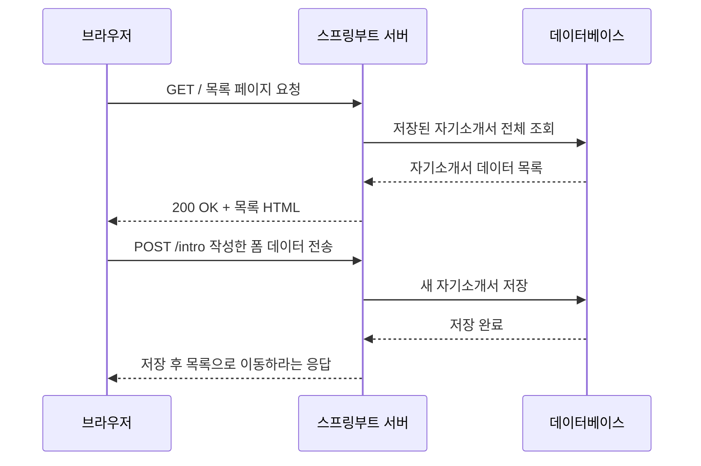

# 01. 스프링부트 이해하기 — 코드 치기 전에 큰 그림 잡기

> **이 문서에서 배우는 것**
> - 정적 웹과 동적 웹의 차이, 그리고 왜 서버와 데이터베이스가 필요한지
> - 브라우저와 서버가 HTTP로 대화하는 방식 (요청/응답, GET/POST, 상태코드)
> - 스프링부트가 무엇이고 왜 쓰는지 (서블릿 → 스프링 → 스프링부트의 흐름)
> - 스프링의 핵심 아이디어 3가지: IoC 컨테이너와 빈, 의존성 주입(DI), 어노테이션

---

## 1. 지금까지 배운 것 vs 이제 배울 것

여러분은 이미 HTML/CSS/JS로 **자기소개 페이지**를 만들어 GitHub Pages에 올려봤습니다.
그 페이지는 어떻게 동작했을까요?

- 여러분이 `index.html` 파일을 미리 만들어 둔다.
- 누가 접속하면 GitHub 서버가 **그 파일을 그대로** 브라우저에 전달한다.
- 누가 언제 접속하든 **항상 똑같은 내용**이 보인다.

이것이 **정적 웹(Static Web)** 입니다. 파일을 미리 만들어 두고, 그대로 전달합니다.

그런데 이번 실습 과제인 **"자기소개서 등록/조회 웹서비스"** 를 생각해 봅시다.

| | 자기소개 페이지 (정적) | 자기소개서 등록 서비스 (동적) |
|---|---|---|
| 내용 | 항상 동일 | 등록된 글에 따라 매번 달라짐 |
| 새 글 등록 | 불가능 (HTML을 직접 수정해야 함) | 폼에 입력하면 즉시 반영 |
| 데이터 보관 | 없음 (HTML 자체가 전부) | 데이터베이스에 저장 |
| 필요한 것 | 파일을 전달하는 서버만 있으면 됨 | 요청을 처리하는 **프로그램(서버)** + **DB** |

새 자기소개서를 등록하면 어딘가에 **저장**되어야 하고, 목록 화면은 저장된 글 수만큼 **그때그때 다르게** 만들어져야 합니다.
즉, 서버가 데이터를 가지고 **그 순간에 HTML을 만들어서** 응답해야 합니다. 이것이 **동적 웹(Dynamic Web)** 입니다.

> 여러분이 만든 자기소개 HTML은 파일을 그대로 전달하는 정적 웹이었습니다.
> 이제는 서버가 데이터를 가지고 그때그때 HTML을 만들어 응답하는 동적 웹을 만듭니다.
> 그 "서버 프로그램"을 자바로 만들게 해주는 도구가 **스프링부트**입니다.

---

## 2. 클라이언트-서버 구조와 HTTP

동적 웹을 만들려면 먼저 브라우저와 서버가 **어떻게 대화하는지**부터 알아야 합니다.

- **클라이언트(브라우저)** 가 서버에 **요청(Request)** 을 보내고,
- **서버**가 그 요청을 처리해서 **응답(Response)** 을 돌려줍니다.

이 대화의 규칙(약속)이 **HTTP**입니다. 개발자도구(F12)의 **Network 탭**에서 봤던 항목 하나하나가 전부 이 요청/응답 한 쌍입니다.

**요청**에는 두 가지 핵심 정보가 있습니다.

1. **URL** — 무엇을 원하는지 (예: `/intro/3` → 3번 자기소개서)
2. **메서드** — 어떤 행동인지
   - `GET`: 데이터를 **조회**할 때 (페이지 보기)
   - `POST`: 데이터를 **보내서 저장/변경**할 때 (폼 제출)

**응답**에는 다음이 담깁니다.

1. **상태코드** — 처리 결과 요약. `200`(성공), `404`(그런 주소 없음), `500`(서버 내부 오류)
2. **본문** — 실제 내용. HTML, JSON 등

이번 실습 과제를 요청/응답 흐름으로 그리면 이렇게 됩니다.



정적 웹에서는 서버가 파일만 찾아 주면 끝이었지만, 여기서는 서버가 **DB를 조회하고, HTML을 조립하고, 저장을 처리**합니다.
이 "가운데에서 일하는 프로그램"을 우리가 자바로 작성하는 것입니다.

이때 서버 프로그램은 보통 역할을 셋으로 나눕니다.
**요청을 받는 컨트롤러(Controller), 실제 처리를 하는 서비스(Service), DB에 읽고 쓰는 저장소(Repository/DAO)** 입니다.
앞으로 이 세 단어가 계속 나오니, 지금은 "역할이 셋으로 나뉜다" 정도만 기억해 두세요.

---

## 3. 자바로 웹서버 만들기의 역사 (짧게)

자바로 이런 서버 프로그램을 만드는 방법은 시대에 따라 점점 편해졌습니다.

**1단계: 서블릿(Servlet)** — 자바 표준의 웹 처리 기술입니다. 요청 하나를 처리하려면 HTML 문자열을 자바 코드 안에서 한 줄씩 이어 붙여야 했습니다. 너무 저수준이라 생산성이 낮았습니다.

**2단계: 스프링(Spring Framework)** — 서블릿의 번거로운 부분을 감싸고, 객체 관리(뒤에서 설명할 IoC/DI)라는 강력한 구조를 제공했습니다. 다만 프로젝트를 시작하려면 XML 설정 파일을 수십~수백 줄 작성해야 했고, 서버(톰캣)도 따로 설치해 배포해야 했습니다. **강력하지만 시작이 무거웠습니다.**

**3단계: 스프링부트(Spring Boot)** — 스프링을 쓰되, 무거운 부분을 자동화한 것입니다.

1. **설정 자동화** — 관례적인 설정을 알아서 해줌. 필요한 것만 `application.properties`에 몇 줄 적으면 됨
2. **내장 톰캣** — 서버가 프로그램 안에 들어 있어서, `main` 메서드 실행 한 번으로 웹서버가 뜸
3. **스타터 의존성** — "웹 만들 거예요(`spring-boot-starter-web`)"라고 선언하면 필요한 라이브러리 묶음이 한 번에 딸려 옴

> **중요:** 스프링부트는 스프링과 별개의 프레임워크가 **아닙니다**.
> "스프링부트 = 스프링을 쉽고 빠르게 쓰게 해주는 도구"입니다.
> 그래서 스프링부트를 배우면 스프링(그리고 스프링 기반인 eGovFrame)을 배운 것과 같습니다.

---

## 4. 스프링의 핵심 아이디어 3가지

여기가 이 문서의 심장입니다. 이 3가지만 잡으면 앞으로 나올 코드가 전부 읽힙니다.

### 4-1. IoC 컨테이너와 빈(Bean) — 객체를 스프링이 만들어 보관한다

자바에서 객체는 보통 내가 `new`로 만듭니다. 그런데 스프링에서는 **주요 객체를 내가 `new` 하지 않습니다.**
스프링이 프로그램 시작 시점에 객체들을 **대신 만들어서 자기 보관함에 넣어두고 관리**합니다.

- 이 보관함을 **IoC 컨테이너**라고 부릅니다.
- 컨테이너에 들어 있는 객체 하나하나를 **빈(Bean)** 이라고 부릅니다.
- IoC(Inversion of Control, 제어의 역전)라는 이름은 "객체 생성의 주도권이 나 → 스프링으로 뒤집혔다"는 뜻입니다.

**왜 이렇게 할까요?**

1. **하나만 만들어 공유하려고** — 서비스 객체를 요청마다 `new` 하면 낭비입니다. 스프링은 기본적으로 한 개만 만들어 모두가 공유하게 합니다.
2. **객체들을 서로 연결해 주려고** — 컨트롤러는 서비스가 필요하고, 서비스는 저장소가 필요합니다. 스프링이 보관함 안에서 이 연결(조립)을 대신 해줍니다. 이 연결이 바로 다음에 나올 DI입니다.

비유하자면 IoC 컨테이너는 **공용 공구함**입니다. 각자 드릴을 사서 들고 다니는 게 아니라, 공구함에 하나 있는 드릴을 필요한 사람에게 꺼내 주는 방식입니다.

### 4-2. 의존성 주입(DI) — 필요한 객체를 스프링이 "넣어준다"

컨트롤러가 서비스를 직접 `new` 하는 코드와 비교해 봅시다.

**스프링 없이 — 내가 직접 new**

```java
public class IntroController {
    // 필요한 객체를 내가 직접 생성한다
    private IntroService introService = new IntroService();
}
```

- `IntroController`가 `IntroService`의 생성 방법까지 알아야 합니다.
- 컨트롤러가 10개면 `IntroService`도 10개 만들어질 수 있습니다.

**스프링 방식 — 생성자로 주입받기**

```java
@Controller
public class IntroController {

    private final IntroService introService;

    // 스프링이 컨테이너에 보관 중인 IntroService 빈을
    // 이 생성자의 인자로 "넣어준다" = 의존성 주입(DI)
    public IntroController(IntroService introService) {
        this.introService = introService;
    }
}
```

- 컨트롤러는 "나 `IntroService` 필요해"라고 생성자로 **선언만** 합니다.
- 스프링이 컨테이너에서 `IntroService` 빈을 찾아 **알아서 넣어줍니다.**
- 이렇게 필요한 객체(의존성)를 외부에서 넣어주는 것을 **의존성 주입(DI, Dependency Injection)** 이라고 합니다.

지금은 "**주요 객체는 내가 new 하지 않고, 생성자로 받는다**" 이 한 문장만 기억하면 충분합니다.

### 4-3. 어노테이션 — @는 스프링에게 보내는 지시문

위 코드의 `@Controller`처럼 **@가 붙은 표식**을 어노테이션이라고 합니다.
어노테이션은 코드 자체를 실행하는 게 아니라, **"스프링아, 이 클래스는 이런 역할이야"라고 알려주는 지시문**입니다.

| 어노테이션 | 스프링에게 전달되는 의미 |
|---|---|
| `@Controller` | "이 클래스는 웹 요청을 받는 담당이야. 빈으로 등록해." |
| `@Service` | "이 클래스는 비즈니스 로직 담당이야. 빈으로 등록해." |
| `@Autowired` | "여기에 맞는 빈을 찾아서 주입해." (생성자가 1개면 생략 가능) |

스프링은 시작할 때 이런 어노테이션이 붙은 클래스들을 스캔해서 빈으로 등록하고, 서로 연결합니다.
자세한 종류와 사용법은 02, 03 문서에서 코드와 함께 다룹니다. 지금은 **"@ = 역할 선언"** 으로 이해하면 됩니다.

---

## 5. 스프링 vs 스프링부트 vs eGovFrame

우리 회사 실무에서는 **전자정부 표준프레임워크(eGovFrame)** 를 씁니다. 셋의 관계를 정리하면 이렇습니다.

| 구분 | 스프링 | 스프링부트 | eGovFrame |
|---|---|---|---|
| 정체 | 자바 웹 개발의 기반 프레임워크 | 스프링을 쉽게 쓰게 해주는 도구 | **스프링 기반** 공공 표준 프레임워크 |
| 설정 | 수동 설정이 많음 | 자동 설정 | 표준 템플릿 제공 (스프링 방식) |
| 화면 기술 | 자유 | 이 교육에서는 Thymeleaf | 주로 JSP |
| DB 접근 | 자유 | 이 교육에서는 JPA | 주로 MyBatis |
| 핵심 구조 | 컨트롤러-서비스-저장소, IoC/DI | **동일** | **동일** |

핵심은 마지막 줄입니다. 화면 기술(Thymeleaf/JSP)이나 DB 접근 방식(JPA/MyBatis)은 갈아 끼우는 부품일 뿐,
**컨트롤러 → 서비스 → 저장소(DAO)로 이어지는 구조와 IoC/DI/어노테이션이라는 뼈대는 셋 다 똑같습니다.**
(DAO는 Data Access Object의 약자로, DB 접근을 담당하는 객체를 뜻합니다. 2절에서 본 "저장소"와 같은 역할입니다.)
지금 스프링부트로 이 뼈대를 이해하면, 나중에 eGovFrame 코드를 열었을 때 구조가 똑같이 보일 것입니다.

---

## 6. 용어 미니 사전

앞으로 계속 나올 단어들입니다. 지금 완벽히 외울 필요는 없고, 헷갈릴 때 돌아와서 찾아보세요.

- **서버(Server)**: 요청을 받아 처리하고 응답하는 컴퓨터, 또는 그 위에서 도는 프로그램.
- **빌드(Build)**: 작성한 소스코드를 실행 가능한 형태(자바는 .jar 등)로 변환·포장하는 과정. 우리는 Gradle이라는 도구가 해줍니다.
- **배포(Deploy)**: 빌드된 결과물을 실제 서버에 올려 사용자들이 쓸 수 있게 하는 것.
- **런타임(Runtime)**: 프로그램이 실제로 실행되고 있는 시점/환경. "런타임 에러"는 실행 중에 난 에러라는 뜻.
- **라이브러리/의존성(Dependency)**: 남이 만들어 둔 코드 묶음(라이브러리)을 내 프로젝트가 가져다 쓰는 것(의존성). `build.gradle`에 선언합니다.
- **프레임워크 vs 라이브러리**: 라이브러리는 **내가 호출**해서 쓰는 도구, 프레임워크는 **정해진 틀 안에 내 코드를 끼워 넣으면 프레임워크가 내 코드를 호출**하는 구조. 스프링은 프레임워크입니다.
- **API**: 프로그램끼리 기능을 주고받기 위한 약속된 창구. "서버 API를 호출한다" = 정해진 URL로 요청을 보낸다.
- **JSON**: 데이터를 주고받을 때 쓰는 텍스트 형식. `{"name": "홍길동"}`처럼 키-값 쌍으로 표현합니다.

---

## 7. 다음 문서 안내

다음 문서에서는 실제로 스프링부트 프로젝트(**intro**)를 만들고, 생성된 폴더와 파일이 각각 무슨 역할인지 뜯어봅니다.
`build.gradle`, `application.properties`, `src/main/java`와 `src/main/resources`가 어떻게 나뉘는지 확인하고,
서버를 처음으로 직접 실행해 봅니다.

---

| 이전 | 다음 |
|---|---|
| [README (학습 로드맵)](./README.md) | [02. 프로젝트 구조](./02_프로젝트_구조.md) |
