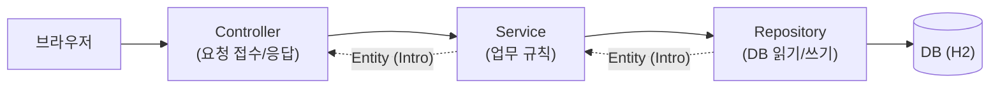
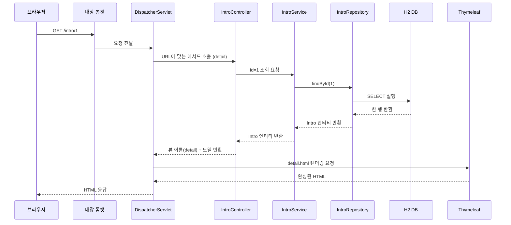

# 02. 스프링부트 프로젝트 구조

> **이 문서에서 배우는 것**
> - start.spring.io로 프로젝트를 만들고 IDE에서 여는 방법
> - 프로젝트 폴더/파일이 각각 무슨 역할인지 (특히 `static` vs `templates`)
> - Controller - Service - Repository로 코드를 나누는 이유 (레이어드 아키텍처)
> - 브라우저 요청 하나가 서버 안에서 어떤 길로 흘러가는지

여러분이 만든 자기소개 HTML은 파일을 그대로 전달하는 **정적 웹**이었습니다. 이제부터 만드는 것은 서버가 데이터를 가지고 그때그때 HTML을 만들어 응답하는 **동적 웹**입니다. 그러려면 "서버 프로젝트"라는 것이 필요한데, 처음 열어 보면 폴더와 파일이 꽤 많습니다. 이 문서에서 그 지도를 그려 드립니다.

---

## 1. 프로젝트 만들기: start.spring.io

스프링부트 프로젝트는 맨손으로 폴더를 만들지 않습니다. 스프링 공식 사이트인 [start.spring.io](https://start.spring.io) 에서 옵션을 고르면 뼈대를 통째로 만들어 줍니다.

실습 프로젝트(**intro**)는 아래 옵션으로 만듭니다. 모든 문서가 이 설정을 전제로 하니 그대로 맞춰 주세요.

| 항목 | 선택 값 | 이유 |
|---|---|---|
| Project | **Gradle - Groovy** | 빌드 도구. 회사/커뮤니티에서 널리 쓰는 조합 |
| Language | **Java** | |
| Spring Boot | **3.5.x** — 목록에서 3.5 계열을 직접 선택 (기본 선택이 4.x일 수 있음) | 완성 샘플 프로젝트와 같은 3.5 계열. 3.x부터 `jakarta.*` 패키지 사용 |
| Group / Artifact | **com.example** / **intro** | 패키지는 `com.example.intro`가 됨 |
| Packaging / Java | **Jar** / **17** | Jar 하나로 실행 가능. Java 17 이상 필수 |
| Dependencies | **Spring Web, Thymeleaf, Spring Data JPA, H2 Database, Spring Boot DevTools** | 아래 3장에서 설명 |

**GENERATE** 버튼을 누르면 `intro.zip`이 다운로드됩니다. 압축을 풀고, IDE에서 그 폴더를 열면 끝입니다. 만약 버전 목록에 3.5 계열이 보이지 않으면, 완성 샘플 프로젝트(`./샘플/intro/`)를 IDE에서 그대로 열어 진행해도 됩니다.

IDE는 **IntelliJ IDEA Community(무료)** 기준으로 설명합니다. `File > Open`으로 압축 푼 폴더를 선택하면 Gradle 프로젝트로 자동 인식하고, 처음 한 번은 의존성(라이브러리)을 내려받느라 몇 분 걸립니다. VSCode(+ Extension Pack for Java, Spring Boot Extension Pack)나 이클립스 계열(STS — 회사 eGovFrame 개발 환경도 이클립스 기반)로도 가능합니다.

---

## 2. 폴더 구조 한눈에

압축을 풀면 이런 구조가 보입니다. 하나씩 짚어 보겠습니다.

```text
intro/
├── build.gradle              # 재료 목록: 의존성과 빌드 설정 (가장 자주 열어 볼 파일)
├── settings.gradle           # 프로젝트 이름 등 Gradle 기본 정보
├── gradlew                   # Gradle을 설치 없이 실행해 주는 스크립트 (macOS/리눅스)
├── gradlew.bat               # 위와 동일 (Windows용)
├── .gitignore                # git에 올리지 않을 것 목록 (build/ 등)
├── gradle/wrapper/           # gradlew가 사용할 Gradle 버전이 기록된 곳
├── src/
│   ├── main/
│   │   ├── java/             # 자바 코드가 사는 곳 (com/example/intro/...)
│   │   └── resources/
│   │       ├── static/       # 그대로 전달되는 파일 — 여러분이 배운 CSS/JS/이미지
│   │       ├── templates/    # 서버가 데이터를 끼워 완성하는 HTML (Thymeleaf)
│   │       └── application.properties   # 설정 파일 (DB 주소, 포트 등)
│   └── test/
│       └── java/             # 테스트 코드
└── build/                    # 빌드 결과물 — 압축 직후에는 없고, 첫 빌드 후 자동 생성됨
```

**꼭 구분해야 하는 두 폴더**가 `static`과 `templates`입니다.

- `static/`: 여러분이 GitHub Pages에 올렸던 것과 같은 세계입니다. 서버는 이 안의 파일을 **가공 없이 그대로** 브라우저에 전달합니다. CSS, JS, 이미지가 여기로 갑니다.
- `templates/`: HTML처럼 생겼지만 완성품이 아닙니다. 서버가 **데이터를 끼워 넣어 완성한 뒤** 전달합니다. 실습의 `list.html`, `form.html`, `detail.html`이 여기에 들어갑니다.

`gradlew`/`gradlew.bat`는 "Gradle 실행기"입니다. 팀원 PC에 Gradle이 설치되어 있지 않아도 이 스크립트가 정해진 버전을 알아서 받아 실행해 주므로, 누가 빌드해도 같은 결과가 나옵니다.

---

## 3. build.gradle 읽는 법

`build.gradle` 전체를 외울 필요는 없습니다. 처음에는 두 블록만 보면 됩니다.

```groovy
plugins {
    id 'java'                                          // 자바 프로젝트라는 선언
    id 'org.springframework.boot' version '3.x.x'      // 스프링부트 플러그인 (실행/빌드 지원)
    id 'io.spring.dependency-management' version '1.x.x' // 라이브러리 버전을 알아서 맞춰 줌
}

dependencies {
    implementation 'org.springframework.boot:spring-boot-starter-web'        // 웹 서버 기능(내장 톰캣 포함)
    implementation 'org.springframework.boot:spring-boot-starter-thymeleaf'  // 템플릿 엔진(HTML에 데이터 끼워 넣기)
    implementation 'org.springframework.boot:spring-boot-starter-data-jpa'   // JPA: 자바 객체와 DB 테이블을 자동으로 짝지어 주는 DB 접근 기술
    runtimeOnly 'com.h2database:h2'                                          // H2: 설치 없이 파일 하나로 동작하는 학습용 경량 DB
    developmentOnly 'org.springframework.boot:spring-boot-devtools'          // 개발 편의(코드 수정 시 자동 재시작)
    testImplementation 'org.springframework.boot:spring-boot-starter-test'   // 테스트
}
```

핵심은 **starter**라는 이름입니다. `spring-boot-starter-web` 한 줄이면 웹 서버 구동에 필요한 라이브러리 수십 개가 **호환되는 버전으로 묶여** 함께 들어옵니다. 01 문서에서 말한 "스프링부트가 조립을 대신해 준다"의 실체가 바로 이것입니다.

`implementation`과 `runtimeOnly`의 차이는 한 줄로: **implementation은 내 코드에서 직접 import해서 쓰는 라이브러리, runtimeOnly는 코드에서는 안 보이지만 실행할 때만 필요한 라이브러리**(H2 드라이버가 대표적)입니다.

---

## 4. 메인 클래스와 실행

`src/main/java/com/example/intro/` 안에 이미 클래스가 하나 만들어져 있습니다.

```java
package com.example.intro;

import org.springframework.boot.SpringApplication;
import org.springframework.boot.autoconfigure.SpringBootApplication;

@SpringBootApplication  // "여기가 스프링부트 앱의 출발점" 표시
public class IntroApplication {

    public static void main(String[] args) {
        // 이 한 줄이 서버를 통째로 띄웁니다
        SpringApplication.run(IntroApplication.class, args);
    }
}
```

이 `main()`을 실행하면 순서대로 이런 일이 일어납니다.

1. **스프링 컨테이너 구동** — 스프링이 객체들을 담아 관리할 공간을 만듭니다.
2. **빈 등록** — `@Controller`, `@Service` 등이 붙은 클래스를 찾아 객체로 만들어 컨테이너에 담습니다. (빈/컨테이너 개념은 [01 문서 4장](./01_스프링부트_이해하기.md) 참고)
3. **내장 톰캣이 8080 포트에서 대기** — 별도 웹 서버 설치 없이, 브라우저 요청을 받을 준비 완료.

실행 방법은 2가지입니다.

- **IDE에서**: `IntroApplication` 파일을 열고 `main()` 옆의 초록 실행(Run) 버튼 클릭.
- **터미널에서**: 프로젝트 폴더에서 아래 명령 실행.

```powershell
# Windows (PowerShell / cmd)
.\gradlew.bat bootRun

# macOS / 리눅스
./gradlew bootRun
```

콘솔 로그에서 이 두 줄이 보이면 성공입니다.

```text
Tomcat started on port 8080 (http)
Started IntroApplication in x.xxx seconds
```

이 상태에서 브라우저로 `http://localhost:8080` 에 접속하면 서버가 응답합니다. (아직 컨트롤러를 안 만들었으니 에러 페이지가 뜨는 것이 정상입니다. 03에서 채웁니다.)

---

## 5. 레이어드 아키텍처 — 코드를 층으로 나누는 이유

서버 코드를 한 파일에 다 넣으면 처음엔 편합니다. 하지만 **화면 처리, 업무 규칙, DB 접근이 한 덩어리로 섞이면 코드가 커질수록 어디를 고쳐야 할지 알 수 없게 됩니다.** 화면 하나 바꾸려다 DB 코드를 건드려 장애를 내는 식입니다. 그래서 처음부터 역할별로 층(layer)을 나눕니다.

식당에 비유하면 이렇습니다. **홀 직원**은 주문을 받고 음식을 내가고(Controller), **주방**은 레시피대로 조리하고(Service), **창고 담당**은 재료를 꺼내고 채워 넣습니다(Repository). 홀 직원이 직접 창고를 뒤지기 시작하면 식당이 커질수록 엉망이 되겠지요.

| 층 | 역할 | 실습(intro)에서의 예 |
|---|---|---|
| **Controller** | 요청 접수, 응답 결정 | `GET /intro/1` 요청을 받아 어떤 화면을 줄지 결정 |
| **Service** | 업무 규칙(비즈니스 로직) | "저장 시 작성일시를 기록한다" 같은 규칙 |
| **Repository** | DB 읽기/쓰기 | Intro 한 건을 DB에서 조회/저장 |

그리고 층 사이를 오가는 **데이터 덩어리**가 **Entity**입니다. 실습에서는 `Intro`(id, name, title, content, createdAt)가 자기소개서 한 건을 표현하며, DB 테이블 한 행과 짝이 됩니다.



---

## 6. 요청 한 번의 여정 — GET /intro/1

브라우저 주소창에 `http://localhost:8080/intro/1` 을 입력했을 때, 서버 안에서 벌어지는 일의 전체 흐름입니다. **여러분이 03에서 만들 "자기소개서 상세보기"가 정확히 이 흐름입니다.**



말로 다시 풀면 이렇습니다.

1. **내장 톰캣**이 요청을 수신합니다.
2. **DispatcherServlet**(스프링의 안내 데스크)이 URL `/intro/1`에 매핑된 컨트롤러 메서드를 찾아 호출합니다. 개발자가 직접 호출하지 않습니다.
3. Controller → Service → Repository 순으로 내려가 DB에서 id가 1인 행을 조회합니다.
4. 조회 결과가 **Intro 엔티티**로 되돌아 올라옵니다.
5. Controller가 엔티티를 **모델**(템플릿에 끼워 넣을 데이터를 담아 전달하는 상자 — 03에서 코드로 확인합니다)에 담아 템플릿 이름(`detail`)과 함께 DispatcherServlet에 돌려주면, DispatcherServlet이 **Thymeleaf**에게 `templates/detail.html` 렌더링을 맡겨 완성된 HTML을 만듭니다.
6. 완성된 HTML이 브라우저로 응답됩니다. 브라우저 입장에서는 정적 페이지를 받을 때와 똑같이 "HTML을 받았을" 뿐입니다. 실제로 개발자도구(F12) Network 탭에서 `GET /intro/1` 요청을 확인해 보면, 정적 페이지 때 봤던 것과 같은 요청/응답 한 쌍이라는 것을 알 수 있습니다.

즉 동적 웹이란, **응답하는 HTML을 서버가 요청 시점에 데이터로 조립한다**는 뜻입니다.

---

## 7. application.properties 미리보기

`src/main/resources/application.properties`에는 처음엔 `spring.application.name=intro` 한 줄만 들어 있습니다. 실습에서는 아래 설정을 사용합니다. (지금은 눈으로만 익히고, 실제 입력과 상세 설명은 03에서 합니다.)

```properties
# 애플리케이션 이름 (프로젝트 생성 시 자동으로 들어 있음)
spring.application.name=intro

# H2 데이터베이스 위치: 프로젝트 폴더 아래 data/introdb 파일에 저장 (서버를 꺼도 데이터 유지)
spring.datasource.url=jdbc:h2:./data/introdb
spring.datasource.driver-class-name=org.h2.Driver
spring.datasource.username=sa
spring.datasource.password=

# 엔티티 클래스를 보고 테이블을 자동 생성/변경 (학습용 설정. 운영에서는 쓰지 않음)
spring.jpa.hibernate.ddl-auto=update

# 실행되는 SQL을 콘솔에 출력 (학습에 매우 유용)
spring.jpa.show-sql=true

# 브라우저에서 DB 내용을 확인하는 H2 콘솔 활성화 (http://localhost:8080/h2-console)
spring.h2.console.enabled=true
```

포인트 하나만: 이 파일 몇 줄로 DB 연결이 끝납니다. 01에서 본 "자동 설정"이 이 값을 읽어 나머지 연결 작업을 대신해 주기 때문입니다.

---

## 8. eGovFrame과의 구조 비교

회사 실무에서 쓰는 전자정부 표준프레임워크(eGovFrame)도 내부는 Spring MVC(Model-View-Controller: 데이터-화면-요청처리를 나누는 스프링의 웹 구조 — 이 문서 5장의 층 나누기가 바로 이 방식입니다)입니다. 층을 나누는 방식이 같아서, 이름만 대응시키면 그대로 읽힙니다. DB 접근을 JPA 대신 MyBatis(Mapper/DAO + SQL을 XML에 작성)로, 화면을 Thymeleaf 대신 JSP로 한다는 점이 주된 차이입니다.

| 이번 교육 (Spring Boot) | 회사 실무 (eGovFrame) | 역할 |
|---|---|---|
| Controller | Controller | 요청 접수/응답 |
| Service | Service (ServiceImpl) | 업무 규칙 |
| Repository (JPA) | DAO / Mapper (MyBatis) | DB 읽기/쓰기 |

즉 스프링부트로 이 구조를 한 번 몸에 익히면, eGovFrame 프로젝트를 열었을 때도 "어디에 무엇이 있는지"가 똑같이 보입니다.

---

## 정리

- 프로젝트는 start.spring.io에서 생성하고, `build.gradle`의 starter들이 라이브러리 묶음을 가져옵니다.
- `static`은 그대로 전달, `templates`는 서버가 완성해서 전달 — 정적 웹과 동적 웹의 경계가 이 두 폴더입니다.
- 코드는 Controller - Service - Repository 층으로 나누고, Entity가 층 사이를 오갑니다.
- 요청 하나는 톰캣 → DispatcherServlet → Controller → Service → Repository → DB → 템플릿 → 응답의 길을 갑니다.

다음 문서에서 이 구조 위에 자기소개서 등록/조회 기능을 직접 만들어 봅니다.

---

⬅ 이전: [01. 스프링부트 이해하기](./01_스프링부트_이해하기.md) | 다음: [03. 실습 — 자기소개서 만들기](./03_실습_자기소개서_만들기.md) ➡
