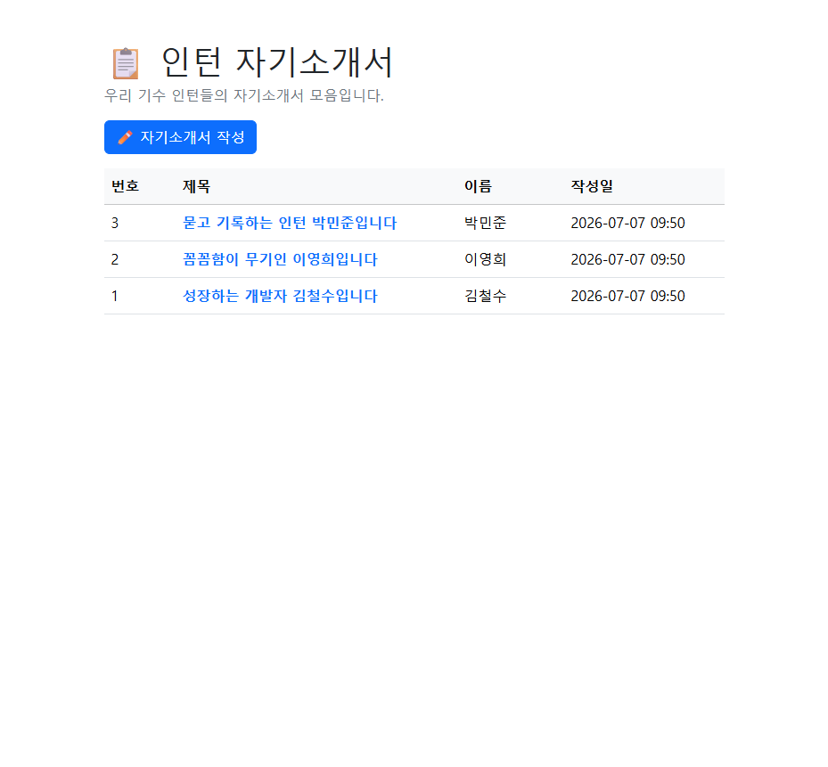
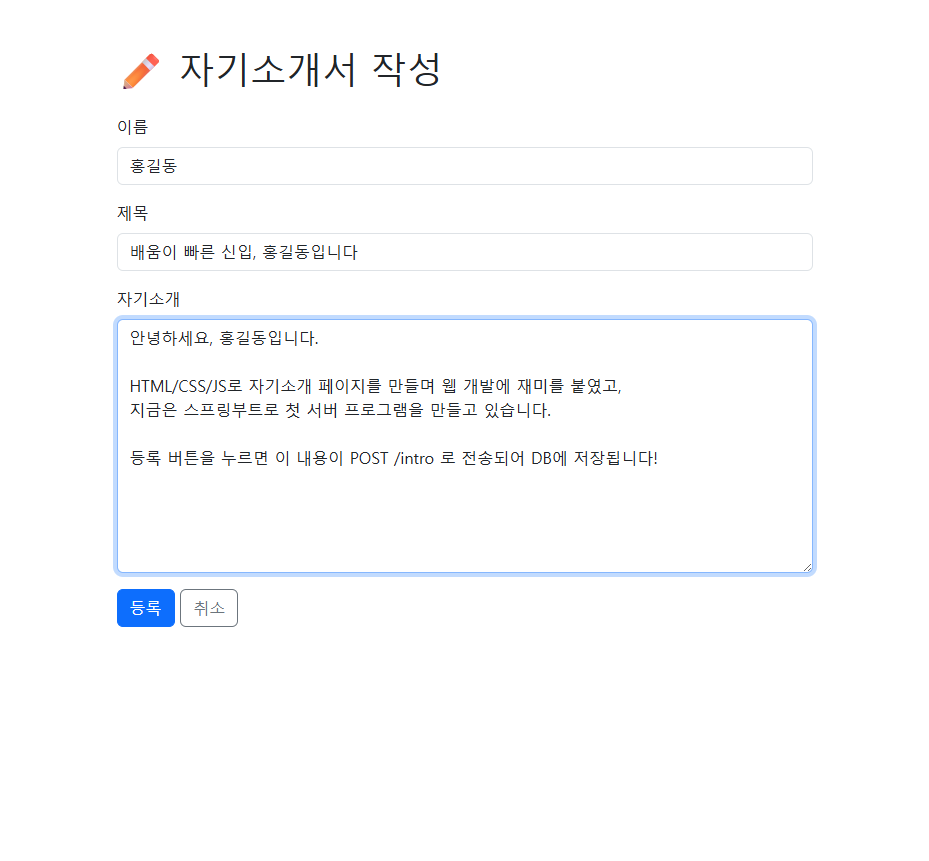
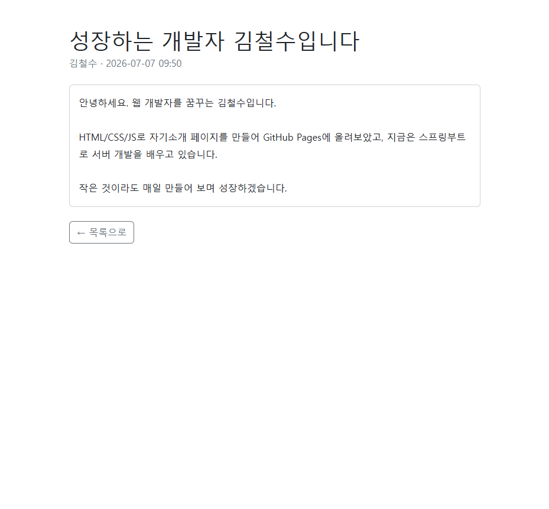
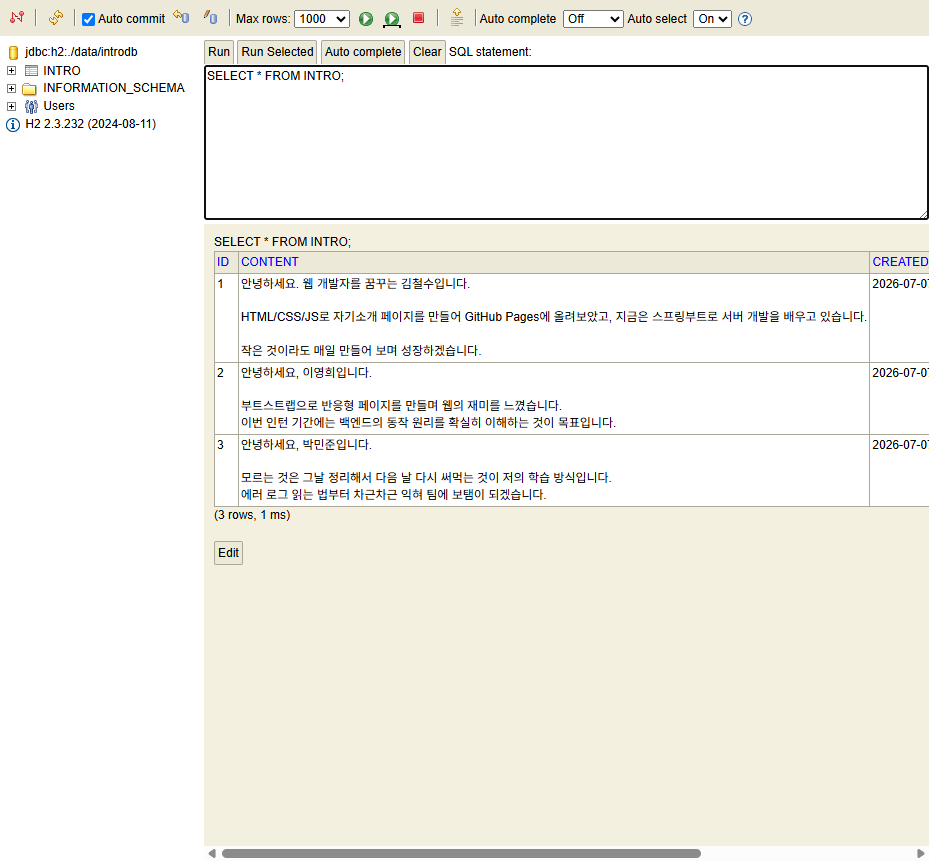

# 03. 실습 — 자기소개서 등록 서비스 만들기

> **이 문서에서 배우는 것**
> - 스프링부트로 "목록 → 작성 → 저장 → 상세보기"가 되는 웹서비스를 처음부터 끝까지 만듭니다.
> - 엔티티 → 리포지토리 → 서비스 → 컨트롤러 → 화면(템플릿) 순서로, 한 단계 만들 때마다 실행해서 눈으로 확인합니다.
> - H2 콘솔로 내가 저장한 데이터가 DB에 실제로 들어갔는지 확인합니다.

여러분은 HTML/CSS로 **정적인 자기소개 페이지**를 만들어 GitHub Pages에 올려봤습니다.
이번에는 **서버가 자기소개서를 저장하고, 목록을 만들어 보여주는 동적 웹서비스**를 만듭니다.

완성된 전체 코드는 [샘플/intro](./샘플/intro/) 폴더에 있습니다.
직접 타이핑하다 막히면 참고하세요. (그대로 복사하는 것보다 직접 치면서 에러를 만나보는 게 훨씬 남습니다!)

---

## 0. 완성 모습 미리보기

| 화면 | URL | 하는 일 |
|---|---|---|
| 목록 | `GET /` | 등록된 자기소개서를 표로 보여줌 |
| 작성 폼 | `GET /intro/new` | 이름/제목/내용 입력 화면 |
| 저장 | `POST /intro` | 입력값을 DB에 저장 후 목록으로 이동 |
| 상세 | `GET /intro/{id}` | 자기소개서 한 건의 전체 내용 |





> 💡 **URL 설계를 먼저 하는 이유**: 컨트롤러의 메서드 하나하나가 위 표의 한 줄과 짝을 이룹니다.
> 표를 먼저 그려두면 "지금 내가 뭘 만들고 있는지" 길을 잃지 않습니다.

---

## 1. 준비 — 프로젝트 생성과 실행 확인

[02. 프로젝트 구조](./02_프로젝트_구조.md)에서 만든 프로젝트를 그대로 사용합니다.
아직 안 만들었다면 start.spring.io에서 아래 옵션으로 생성하세요.

- Project: **Gradle - Groovy** / Language: **Java** / Spring Boot: **3.5.x**
- Group: `com.example` / Artifact: `intro` / Package name: `com.example.intro`
- Packaging: **Jar** / Java: **17**
- Dependencies: **Spring Web, Thymeleaf, Spring Data JPA, H2 Database, Spring Boot DevTools**

IDE에서 프로젝트를 열고 `IntroApplication`을 실행했을 때
콘솔에 `Tomcat started on port 8080`이 보이면 준비 완료입니다.

---

## 2. Step 1 — 설정: application.properties

`src/main/resources/application.properties`를 아래처럼 작성합니다.
**설정 파일은 한 줄 한 줄이 "왜 있는지" 알고 넘어가야** 나중에 에러가 났을 때 스스로 고칠 수 있습니다.

```properties
# 애플리케이션 이름
spring.application.name=intro

# ===== H2 데이터베이스 (파일 모드) =====
# 프로젝트 폴더 아래 data/introdb 파일에 데이터를 저장합니다.
# 파일 모드라서 서버를 껐다 켜도 데이터가 남아 있습니다.
spring.datasource.url=jdbc:h2:./data/introdb
spring.datasource.driver-class-name=org.h2.Driver
spring.datasource.username=sa
spring.datasource.password=

# ===== H2 웹 콘솔 =====
# 브라우저에서 http://localhost:8080/h2-console 로 DB 내용을 직접 볼 수 있습니다.
spring.h2.console.enabled=true
spring.h2.console.path=/h2-console

# ===== JPA =====
# update: 엔티티 클래스에 맞춰 테이블을 자동으로 만들고, 기존 데이터는 유지합니다.
# (create로 바꾸면 재시작할 때마다 테이블을 지우고 새로 만드니 주의! → 04 문서 B5)
spring.jpa.hibernate.ddl-auto=update

# 콘솔에 실행되는 SQL을 보여줍니다. JPA가 만든 SQL을 눈으로 확인해 보세요.
spring.jpa.show-sql=true
spring.jpa.properties.hibernate.format_sql=true
```

> ⚠️ **H2는 실습용 DB입니다.** 설치 없이 바로 쓸 수 있어 학습에 좋지만,
> 실무에서는 Oracle, MySQL, PostgreSQL 같은 DB를 씁니다. 연결 설정만 바꾸면 코드는 거의 그대로입니다.

---

## 3. Step 2 — 엔티티: 자기소개서의 "설계도"

**엔티티(Entity)는 DB 테이블과 짝을 이루는 자바 클래스**입니다.
"자기소개서 한 건에는 어떤 정보가 들어가는가?"를 클래스로 표현합니다.

`src/main/java/com/example/intro/domain/Intro.java`

```java
package com.example.intro.domain;

import jakarta.persistence.Column;
import jakarta.persistence.Entity;
import jakarta.persistence.GeneratedValue;
import jakarta.persistence.GenerationType;
import jakarta.persistence.Id;
import java.time.LocalDateTime;

@Entity // "이 클래스는 DB 테이블과 짝"이라고 JPA에게 알려주는 표식
public class Intro {

    // 기본키(PK). DB가 1, 2, 3... 순서대로 번호를 자동으로 매겨줍니다.
    @Id
    @GeneratedValue(strategy = GenerationType.IDENTITY)
    private Long id;

    private String name;   // 작성자 이름
    private String title;  // 자기소개서 제목

    @Column(length = 4000) // 길게 쓸 수 있도록 컬럼 길이를 넉넉하게
    private String content; // 자기소개 내용

    private LocalDateTime createdAt; // 작성 시각

    // JPA가 객체를 만들 때 쓰는 기본 생성자 (엔티티에 반드시 필요)
    public Intro() {
    }

    // ===== getter / setter =====
    public Long getId() { return id; }
    public void setId(Long id) { this.id = id; }
    public String getName() { return name; }
    public void setName(String name) { this.name = name; }
    public String getTitle() { return title; }
    public void setTitle(String title) { this.title = title; }
    public String getContent() { return content; }
    public void setContent(String content) { this.content = content; }
    public LocalDateTime getCreatedAt() { return createdAt; }
    public void setCreatedAt(LocalDateTime createdAt) { this.createdAt = createdAt; }
}
```

> 📌 import가 `jakarta.persistence.*` 인 것에 주목하세요.
> 인터넷 옛날 자료에는 `javax.persistence`로 나오는데, **스프링부트 3부터는 jakarta**입니다. (→ [04 문서](./04_헷갈리기_쉬운_개념.md))

### ✅ 확인하기
애플리케이션을 재시작하면 콘솔에 이런 SQL이 지나갑니다. **엔티티를 보고 JPA가 테이블을 대신 만들어 준 것**입니다.

```
Hibernate:
    create table intro (
        id bigint generated by default as identity,
        content varchar(4000),
        created_at timestamp(6),
        name varchar(255),
        title varchar(255),
        primary key (id)
    )
```

브라우저에서 `http://localhost:8080/h2-console` 접속 → JDBC URL에 `jdbc:h2:./data/introdb` 입력(설정 파일과 동일하게) → Connect.
왼쪽 트리에 `INTRO` 테이블이 보이면 성공입니다. (아직 데이터는 0건이 정상입니다.)

---

## 4. Step 3 — 리포지토리: DB 창구

**리포지토리(Repository)는 DB에 읽고 쓰는 일을 전담하는 창구**입니다.
놀랍게도, 인터페이스 선언 한 줄이면 끝납니다.

`src/main/java/com/example/intro/repository/IntroRepository.java`

```java
package com.example.intro.repository;

import com.example.intro.domain.Intro;
import org.springframework.data.jpa.repository.JpaRepository;

// <Intro, Long> : "Intro 엔티티를 다루고, 기본키(id) 타입은 Long"
public interface IntroRepository extends JpaRepository<Intro, Long> {
}
```

`JpaRepository`를 상속받는 것만으로 아래 메서드가 자동으로 생깁니다.

| 메서드 | 하는 일 | 실제 실행되는 SQL |
|---|---|---|
| `save(intro)` | 저장 | `INSERT INTO intro ...` |
| `findAll()` | 전체 조회 | `SELECT * FROM intro` |
| `findById(id)` | 한 건 조회 | `SELECT ... WHERE id = ?` |
| `delete(intro)` | 삭제 | `DELETE FROM intro WHERE id = ?` |

> 🤔 "구현 코드가 없는데 어떻게 동작하죠?" — 좋은 질문입니다.
> 스프링이 실행 시점에 이 인터페이스의 구현체를 만들어 빈으로 등록해 줍니다. 원리는 [04 문서 A7](./04_헷갈리기_쉬운_개념.md)에서.

---

## 5. Step 4 — 서비스: 업무 규칙 담당

**서비스(Service)는 "업무 규칙"을 담당**합니다.
"저장할 때 작성 시각은 서버가 기록한다", "없는 글을 찾으면 알려준다" 같은 규칙이 여기에 삽니다.

`src/main/java/com/example/intro/service/IntroService.java`

```java
package com.example.intro.service;

import com.example.intro.domain.Intro;
import com.example.intro.repository.IntroRepository;
import java.time.LocalDateTime;
import java.util.List;
import org.springframework.data.domain.Sort;
import org.springframework.stereotype.Service;

@Service // "이 클래스를 빈(Bean)으로 등록해 줘"라는 표식
public class IntroService {

    private final IntroRepository introRepository;

    // 생성자 주입(DI): 스프링이 IntroRepository를 자동으로 넣어줍니다.
    // new IntroRepository() 라고 직접 만들지 않는 것이 핵심! (→ 04 문서 A5)
    public IntroService(IntroRepository introRepository) {
        this.introRepository = introRepository;
    }

    /** 전체 목록: 최신 글이 위로 오도록 id 내림차순 정렬 */
    public List<Intro> findAll() {
        return introRepository.findAll(Sort.by(Sort.Direction.DESC, "id"));
    }

    /** 한 건 조회: 없으면 예외를 던져서 알립니다 */
    public Intro findById(Long id) {
        return introRepository.findById(id)
                .orElseThrow(() -> new IllegalArgumentException("존재하지 않는 자기소개서입니다. id=" + id));
    }

    /** 새 자기소개서 저장: 작성 시각은 서버가 기록 */
    public Intro create(String name, String title, String content) {
        Intro intro = new Intro();
        intro.setName(name);
        intro.setTitle(title);
        intro.setContent(content);
        intro.setCreatedAt(LocalDateTime.now());
        return introRepository.save(intro); // 이 한 줄이 INSERT문으로 번역됩니다.
    }
}
```

> 💡 지금은 서비스가 리포지토리를 부르기만 해서 "굳이 왜 나누지?" 싶을 수 있습니다.
> 서비스가 얇은 것은 정상입니다. 나중에 "제목이 비어 있으면 저장 거부", "하루 1건만 등록 가능" 같은
> 규칙이 생기면 전부 여기에 들어옵니다. 컨트롤러와 DB 코드는 건드리지 않고요.

---

## 6. Step 5 — 컨트롤러와 목록 화면

**컨트롤러(Controller)는 브라우저의 요청을 가장 먼저 받는 곳**입니다.
먼저 목록 기능 하나만 만들어 실행해 봅니다.

`src/main/java/com/example/intro/controller/IntroController.java`

```java
package com.example.intro.controller;

import com.example.intro.service.IntroService;
import org.springframework.stereotype.Controller;
import org.springframework.ui.Model;
import org.springframework.web.bind.annotation.GetMapping;

@Controller // 요청을 받아 "보여줄 화면 이름"을 반환하는 클래스
public class IntroController {

    private final IntroService introService;

    public IntroController(IntroService introService) {
        this.introService = introService;
    }

    /** 목록 화면: GET / */
    @GetMapping("/")
    public String list(Model model) {
        // Model: 서버의 데이터를 템플릿(HTML)에 전달하는 "쟁반"
        model.addAttribute("intros", introService.findAll());
        return "list"; // → templates/list.html 을 찾아 렌더링
    }
}
```

이어서 화면입니다. `src/main/resources/templates/list.html`

```html
<!DOCTYPE html>
<!-- xmlns:th : "th: 로 시작하는 속성은 Thymeleaf 문법"이라는 선언 -->
<html lang="ko" xmlns:th="http://www.thymeleaf.org">
<head>
    <meta charset="UTF-8">
    <meta name="viewport" content="width=device-width, initial-scale=1.0">
    <title>자기소개서 목록</title>
    <!-- 여러분이 배운 Bootstrap을 그대로 씁니다 -->
    <link href="https://cdn.jsdelivr.net/npm/bootstrap@5.3.3/dist/css/bootstrap.min.css" rel="stylesheet">
</head>
<body>
<div class="container py-5">

    <h1 class="mb-1">📋 인턴 자기소개서</h1>
    <p class="text-secondary">우리 기수 인턴들의 자기소개서 모음입니다.</p>

    <a class="btn btn-primary mb-3" th:href="@{/intro/new}">✏️ 자기소개서 작성</a>

    <table class="table table-hover align-middle">
        <thead class="table-light">
        <tr>
            <th scope="col" style="width: 80px">번호</th>
            <th scope="col">제목</th>
            <th scope="col" style="width: 120px">이름</th>
            <th scope="col" style="width: 180px">작성일</th>
        </tr>
        </thead>
        <tbody>
        <!-- th:each : Model에 담겨 온 intros 목록을 한 줄씩 반복 -->
        <tr th:each="intro : ${intros}">
            <td th:text="${intro.id}">1</td>
            <td>
                <a th:href="@{/intro/{id}(id=${intro.id})}" th:text="${intro.title}">제목 예시</a>
            </td>
            <td th:text="${intro.name}">홍길동</td>
            <td th:text="${#temporals.format(intro.createdAt, 'yyyy-MM-dd HH:mm')}">2026-07-06 10:00</td>
        </tr>
        <!-- 목록이 비어 있을 때만 보이는 안내 행 -->
        <tr th:if="${#lists.isEmpty(intros)}">
            <td colspan="4" class="text-center text-secondary py-4">
                아직 등록된 자기소개서가 없습니다. 첫 번째 작성자가 되어 보세요!
            </td>
        </tr>
        </tbody>
    </table>

</div>
</body>
</html>
```

처음 보는 Thymeleaf 문법 정리:

| 문법 | 의미 |
|---|---|
| `th:text="${intro.title}"` | 태그 안 내용물을 서버 데이터로 교체 |
| `th:each="intro : ${intros}"` | 목록을 반복하며 행을 생성 (JS의 for...of와 비슷한 느낌) |
| `th:href="@{/intro/new}"` | 링크 주소 생성 (`@{...}`는 URL 전용 문법) |
| `th:if="${...}"` | 조건이 참일 때만 이 태그를 출력 |

> ⚠️ `${...}`는 **서버에서** 실행되는 Thymeleaf 문법입니다. JS 템플릿 리터럴의 `${}`와 생김새만 같아요.
> 브라우저에서 "페이지 소스 보기"를 하면 이미 값으로 바뀌어 있습니다. (→ [04 문서 A8](./04_헷갈리기_쉬운_개념.md))

### ✅ 확인하기
재시작 후 `http://localhost:8080` 접속.
**"아직 등록된 자기소개서가 없습니다"** 가 표시되면 성공입니다.
컨트롤러 → 서비스 → 리포지토리 → DB(빈 테이블) → 템플릿까지 전체 흐름이 연결된 것입니다!

---

## 7. Step 6 — 작성 폼과 저장

이제 데이터를 넣을 차례입니다. 컨트롤러에 메서드 2개를 **추가**합니다.

```java
// (기존 import에 추가)
import org.springframework.web.bind.annotation.PostMapping;
import org.springframework.web.bind.annotation.RequestParam;

    /** 작성 폼 화면: GET /intro/new */
    @GetMapping("/intro/new")
    public String form() {
        return "form"; // → templates/form.html
    }

    /**
     * 저장 처리: POST /intro
     * @RequestParam : 폼 입력값(name 속성 기준)을 파라미터로 받습니다.
     */
    @PostMapping("/intro")
    public String create(@RequestParam String name,
                         @RequestParam String title,
                         @RequestParam String content) {
        introService.create(name, title, content);
        return "redirect:/"; // 저장 후 목록으로 "다시 가라"고 브라우저에 지시
    }
```

`src/main/resources/templates/form.html`

```html
<!DOCTYPE html>
<html lang="ko" xmlns:th="http://www.thymeleaf.org">
<head>
    <meta charset="UTF-8">
    <meta name="viewport" content="width=device-width, initial-scale=1.0">
    <title>자기소개서 작성</title>
    <link href="https://cdn.jsdelivr.net/npm/bootstrap@5.3.3/dist/css/bootstrap.min.css" rel="stylesheet">
</head>
<body>
<div class="container py-5" style="max-width: 720px">

    <h1 class="mb-4">✏️ 자기소개서 작성</h1>

    <!-- 등록 버튼을 누르면 POST /intro 로 입력값이 전송됩니다.
         input의 name 속성이 컨트롤러 @RequestParam 이름과 짝을 이룹니다. -->
    <form th:action="@{/intro}" method="post">

        <div class="mb-3">
            <label for="name" class="form-label">이름</label>
            <input type="text" class="form-control" id="name" name="name"
                   placeholder="예: 김철수" required>
        </div>

        <div class="mb-3">
            <label for="title" class="form-label">제목</label>
            <input type="text" class="form-control" id="title" name="title"
                   placeholder="예: 성장하는 개발자 김철수입니다" required>
        </div>

        <div class="mb-3">
            <label for="content" class="form-label">자기소개</label>
            <textarea class="form-control" id="content" name="content" rows="10"
                      placeholder="자신을 자유롭게 소개해 주세요." required></textarea>
        </div>

        <button type="submit" class="btn btn-primary">등록</button>
        <a th:href="@{/}" class="btn btn-outline-secondary">취소</a>
    </form>

</div>
</body>
</html>
```

**여기서 HTML 수업 때 배운 form이 드디어 진짜 일을 합니다.**
그때는 전송할 서버가 없었지만, 지금은 여러분이 만든 서버가 받아줍니다.

- `method="post"` → 데이터를 만드는 요청이므로 POST (→ 04 문서 A2)
- `name="title"` → 이 이름 그대로 `@RequestParam String title`에 도착
- `redirect:/` → 저장 후 새로고침해도 중복 등록되지 않게 목록으로 돌려보내기 (**PRG 패턴**)

### ✅ 확인하기
1. 재시작 → 목록에서 "자기소개서 작성" 버튼 클릭 → 작성 → 등록
2. 목록에 내 글이 보이면 성공!
3. 콘솔에서 `insert into intro ...` SQL 로그 확인
4. H2 콘솔에서 `SELECT * FROM INTRO;` 실행 → 내 데이터가 진짜 DB에 있는 것 확인
5. 서버를 껐다 다시 켜도 데이터가 남아 있는지 확인 (파일 DB니까 남아 있어야 정상)



---

## 8. Step 7 — 상세 보기

목록에서 제목을 누르면 전체 내용을 보여줍니다. 컨트롤러에 메서드 하나를 추가합니다.

```java
// (기존 import에 추가)
import org.springframework.web.bind.annotation.PathVariable;

    /**
     * 상세 화면: GET /intro/{id}  (예: /intro/3)
     * @PathVariable : URL 경로에 들어있는 값(3)을 파라미터로 받습니다.
     */
    @GetMapping("/intro/{id}")
    public String detail(@PathVariable Long id, Model model) {
        model.addAttribute("intro", introService.findById(id));
        return "detail"; // → templates/detail.html
    }
```

`src/main/resources/templates/detail.html`

```html
<!DOCTYPE html>
<html lang="ko" xmlns:th="http://www.thymeleaf.org">
<head>
    <meta charset="UTF-8">
    <meta name="viewport" content="width=device-width, initial-scale=1.0">
    <title>자기소개서 상세</title>
    <link href="https://cdn.jsdelivr.net/npm/bootstrap@5.3.3/dist/css/bootstrap.min.css" rel="stylesheet">
    <link rel="stylesheet" th:href="@{/css/style.css}">
</head>
<body>
<div class="container py-5" style="max-width: 720px">

    <h1 class="mb-1" th:text="${intro.title}">제목 예시</h1>
    <p class="text-secondary mb-4">
        <span th:text="${intro.name}">홍길동</span> ·
        <span th:text="${#temporals.format(intro.createdAt, 'yyyy-MM-dd HH:mm')}">2026-07-06 10:00</span>
    </p>

    <div class="card">
        <!-- content-box: 입력한 줄바꿈을 그대로 보여주는 스타일 (아래 Step 8) -->
        <div class="card-body content-box" th:text="${intro.content}">
            자기소개 내용 예시입니다.
        </div>
    </div>

    <a th:href="@{/}" class="btn btn-outline-secondary mt-4">← 목록으로</a>

</div>
</body>
</html>
```

### ✅ 확인하기
목록에서 제목 클릭 → 상세 화면이 나오면 성공.
주소창의 `/intro/1`에서 숫자를 `/intro/999`로 바꿔보세요. 에러가 납니다.
콘솔에 찍힌 `IllegalArgumentException: 존재하지 않는 자기소개서입니다. id=999`를 직접 읽어보세요.
**에러 로그를 읽는 연습**도 실습의 일부입니다. (→ [04 문서 B2](./04_헷갈리기_쉬운_개념.md))

---

## 9. Step 8 — 내 CSS 입히기 (static 폴더)

여러분이 배운 CSS 실력을 쓸 차례입니다.
`src/main/resources/static/css/style.css` 를 만듭니다.

```css
/* static 폴더의 파일은 서버가 가공 없이 "그대로" 브라우저에 전달합니다. */

/* 자기소개 내용: 입력한 줄바꿈을 그대로 화면에 보여줍니다 */
.content-box {
    white-space: pre-line;
    line-height: 1.8;
    min-height: 200px;
}
```

각 템플릿의 `<head>`에 아래 한 줄을 추가하면 적용됩니다.

```html
<link rel="stylesheet" th:href="@{/css/style.css}">
```

> ⚠️ CSS/JS/이미지는 반드시 **static** 폴더에! templates에 넣으면 404가 납니다. (→ [04 문서 A6](./04_헷갈리기_쉬운_개념.md))

---

## 10. 완성! 전체 구조 다시 보기

```
intro/
├── build.gradle
└── src/main/
    ├── java/com/example/intro/
    │   ├── IntroApplication.java          # 시작점 (@SpringBootApplication)
    │   ├── controller/IntroController.java # 요청 접수, 화면 선택
    │   ├── service/IntroService.java       # 업무 규칙
    │   ├── repository/IntroRepository.java # DB 창구
    │   └── domain/Intro.java               # 자기소개서 설계도 (엔티티)
    └── resources/
        ├── application.properties          # 설정
        ├── static/css/style.css            # 그대로 전달되는 파일
        └── templates/                      # 서버가 완성해 주는 HTML
            ├── list.html
            ├── form.html
            └── detail.html
```

**"글 등록" 버튼을 눌렀을 때 일어나는 일**을 스스로 말로 설명할 수 있으면 이번 실습의 목표는 달성입니다.
(form의 POST → 컨트롤러 `@PostMapping` → 서비스 → 리포지토리 `save()` → INSERT → redirect → 목록 GET → ...)

---

## 11. 도전 과제 (필수 아님, 실력 UP)

난이도 순입니다. 하나씩 도전해 보세요.

1. **꾸미기** — Bootstrap 카드/네비바로 목록 화면을 예쁘게 (배운 것 활용)
2. **삭제 기능** — 상세 화면에 삭제 버튼 추가 (`POST /intro/{id}/delete` → `repository.deleteById(id)`)
3. **수정 기능** — 기존 값이 채워진 폼을 보여주고 저장 (삭제보다 어렵습니다)
4. **검증 강화** — 제목이 공백뿐이면 저장을 거부하는 규칙을 **서비스**에 추가
5. **(심화) 사진 업로드** — 프로필 사진 첨부. 파일 저장 경로, MultipartFile을 공부해야 합니다.

---

## 12. 완성 샘플 실행 방법

직접 만든 것과 비교하고 싶을 때, [샘플/intro](./샘플/intro/)를 실행해 볼 수 있습니다.

```
cd 샘플/intro
.\gradlew.bat bootRun     (Windows / macOS·리눅스는 ./gradlew bootRun)
```

브라우저에서 `http://localhost:8080` 접속. 종료는 콘솔에서 `Ctrl + C`.

---

⬅️ 이전: [02. 프로젝트 구조](./02_프로젝트_구조.md) | 다음: [04. 헷갈리기 쉬운 개념](./04_헷갈리기_쉬운_개념.md) ➡️
