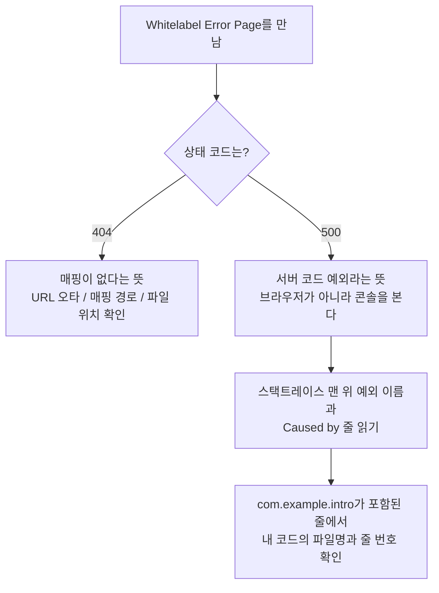

# 04. 헷갈리기 쉬운 개념 & 단골 에러 사전

> **이 문서에서 배우는 것**
> - 실습(03) 중에 반드시 마주치는 헷갈리는 개념 9가지 — 질문 → 짧은 답 → 코드/표 비교
> - 단골 에러 7가지를 "증상 → 원인 → 해결" 순서로 읽는 법
> - 에러 메시지를 스스로 해석하는 3단계 습관
> - 실무(eGovFrame/MyBatis)로 넘어갈 때 달라지는 것과 그대로인 것

이 문서는 처음부터 끝까지 읽는 문서가 아닙니다. **실습을 하다 막혔을 때 목차에서 증상을 찾아 펼쳐 보는 사전**입니다. 03 문서 실습을 진행하면서 옆에 띄워 두세요.

---

## 파트 A. 헷갈리는 개념

### A1. @Controller와 @RestController는 뭐가 다른가요?

**짧은 답: `@Controller`는 화면(템플릿 이름)을 반환하고, `@RestController`는 데이터(JSON/문자열)를 그대로 반환합니다.**

대표 증상: "브라우저에 HTML 화면 대신 `list`라는 글자만 덜렁 나와요." → `@RestController`를 붙였기 때문입니다. 반환한 문자열 `"list"`를 템플릿 이름이 아니라 **응답 본문 그 자체**로 내보낸 것입니다.

```java
@Controller          // 반환값 "list" → templates/list.html을 찾아 렌더링
public class IntroController {
    @GetMapping("/")
    public String list(Model model) {
        return "list";   // 화면 이름
    }
}

@RestController      // 반환값 "list" → 글자 "list"가 그대로 응답됨
public class IntroApiController {
    @GetMapping("/api/hello")
    public String hello() {
        return "list";   // 데이터 그 자체
    }
}
```

한 줄 정리: `@RestController` = `@Controller` + `@ResponseBody`. `@ResponseBody`가 "반환값을 화면 이름으로 해석하지 말고 응답 본문에 바로 써라"는 표시입니다. 이번 실습은 화면을 만드니 **`@Controller`만 사용**합니다.

### A2. GET과 POST는 언제 구분해서 쓰나요?

**짧은 답: 조회(읽기)는 GET, 생성/변경은 POST입니다.**

| 구분 | GET | POST |
|---|---|---|
| 용도 | 조회 (목록, 상세, 작성 폼 열기) | 생성/변경 (자기소개서 저장) |
| 데이터 위치 | URL 뒤 `?name=철수` | 요청 본문(주소창에 안 보임) |
| 새로고침 | 안전 (같은 조회 반복) | 위험 (같은 등록이 반복될 수 있음) |

단골 사고: `<form>`에 `method="post"`를 빼먹으면 **기본값인 GET으로 전송**됩니다. 그러면 `@PostMapping("/intro")`와 매칭되지 않아 **405 (Method Not Allowed)** 가 나거나, 입력한 내용이 주소창에 `?name=...&content=...`로 노출됩니다. 폼이 실제로 GET/POST 중 무엇으로 나갔는지는 개발자도구(F12) Network 탭의 **Request Method**에서 확인할 수 있습니다.

```html
<!-- method="post"를 꼭 명시 -->
<form th:action="@{/intro}" method="post"> ... </form>
```

**저장 후 왜 `redirect:/`로 돌려보내나요?** — 저장 결과 화면을 POST 응답으로 직접 그리면, 사용자가 새로고침할 때 브라우저가 POST를 한 번 더 보내 **같은 글이 또 등록**됩니다. 그래서 저장이 끝나면 "목록으로 다시 요청하라"고 브라우저에게 알려주는 것이 **PRG 패턴(Post-Redirect-Get)** 입니다.

```java
@PostMapping("/intro")
public String create(@RequestParam String name,
                     @RequestParam String title,
                     @RequestParam String content) {
    introService.create(name, title, content);
    return "redirect:/";   // 새로고침해도 목록 조회(GET)만 반복됨
}
```

### A3. @RequestParam, @PathVariable, @ModelAttribute는 언제 쓰나요?

**짧은 답: URL 뒤 `?이름=값`은 `@RequestParam`, URL 경로 속 값은 `@PathVariable`, 폼 전체를 객체로 받을 때는 `@ModelAttribute`입니다.**

아래 1·2번은 실습 코드에 실제로 있는 예시이고, 3번은 실습에는 등장하지 않는 "이렇게 바꿔 쓸 수도 있다" 예시입니다.

```java
// 1) @RequestParam — 폼 입력값이나 /list?name=철수 처럼 이름=값으로 전달되는 값 (실습의 저장 코드)
@PostMapping("/intro")
public String create(@RequestParam String name,
                     @RequestParam String title,
                     @RequestParam String content) { ... }

// 2) @PathVariable — /intro/3 처럼 경로 자체에 들어있는 값 (실습의 상세보기 코드)
@GetMapping("/intro/{id}")
public String detail(@PathVariable Long id, Model model) {
    model.addAttribute("intro", introService.findById(id));
    return "detail";
}

// 3) @ModelAttribute — 폼의 입력값 여러 개를 객체 하나로 묶어서 (실습에는 없는 개선 예시)
//    입력 필드가 많아지면 1)처럼 파라미터를 늘리는 대신 이렇게 객체로 받습니다.
@PostMapping("/intro")
public String create(@ModelAttribute Intro intro) {
    // 폼의 name, title, content가 intro 객체의 같은 이름 필드에 자동으로 채워짐
    ...
}
```

참고 한 줄: `@RequestBody`는 폼이 아니라 **JSON을 보내는 API**에서 쓰는 것이라, 이번 실습에서는 등장하지 않습니다.

### A4. Entity(Intro)를 화면까지 그대로 보내도 되나요?

**짧은 답: 이번 실습 규모에서는 괜찮습니다. 실무에서는 DTO라는 별도 객체로 분리합니다.**

분리하는 이유는 두 가지입니다.

1. **화면 요구와 DB 구조는 다르게 변합니다.** 화면에 "작성일을 yyyy-MM-dd로 보여달라", "이름과 제목을 합쳐 달라" 같은 요구가 생길 때마다 DB 테이블과 1:1인 Entity를 고치면 저장 로직까지 흔들립니다.
2. **민감정보 노출 방지.** Entity에 비밀번호·주민등록번호 같은 필드가 있으면 화면(또는 JSON)에 통째로 딸려 나갈 수 있습니다.

그래서 실무 코드에는 `IntroDto`, `IntroVO` 같은 "화면 전달용 객체"가 따로 있습니다. 지금은 **"Entity는 DB용, DTO는 화면용으로 나누는 문화가 있다"** 정도만 기억하면 됩니다.

### A5. 왜 `new IntroService()`라고 쓰면 안 되나요?

**짧은 답: 스프링이 관리하는 빈(Bean)과 내가 `new`로 만든 객체는 서로 다른 존재이기 때문입니다.**

스프링은 `@Service`, `@Repository` 같은 표시가 붙은 클래스를 직접 생성해 컨테이너에 보관하고, 필요한 곳에 연결(주입)해 줍니다. 그런데 내가 `new IntroService()`를 하면 스프링이 모르는 별도 객체가 생기고, **그 안에 주입되어야 할 `IntroRepository`가 `null`인 채**라 저장하는 순간 `NullPointerException`이 터집니다.

```java
// 잘못된 예 — repository가 채워지지 않은 객체
IntroService service = new IntroService(null);   // 스프링이 모르는 객체
service.create("김철수", "제목", "내용");           // 내부 repository가 null → NPE
// (참고: 우리 IntroService는 생성자에서 리포지토리를 반드시 받게 되어 있어
//  new IntroService() 처럼 빈손으로는 컴파일조차 안 됩니다 — 생성자 주입의 장점!)

// 표준 — 생성자 주입: 스프링이 만들어 둔 빈을 생성자로 받는다
@Controller
public class IntroController {
    private final IntroService introService;   // final 가능

    // 생성자가 하나면 @Autowired 생략 가능 — 스프링이 알아서 넣어줌
    public IntroController(IntroService introService) {
        this.introService = introService;
    }
}
```

필드에 `@Autowired`를 붙이는 방식(필드 주입)도 동작은 하지만, 생성자 주입이 표준인 이유는 두 가지입니다. **① `final`로 선언할 수 있어 주입이 누락되면 컴파일 단계에서 잡히고, ② 테스트할 때 스프링 없이도 `new IntroController(가짜Service)`처럼 직접 넣어볼 수 있습니다.** 회사의 eGovFrame 코드에서도 Service를 `new`로 만들지 않고 주입받아 쓰는 구조는 완전히 동일합니다.

### A6. static 폴더와 templates 폴더는 뭐가 다른가요?

**짧은 답: `static`은 파일이 가공 없이 그대로 나가고, `templates`는 컨트롤러를 거쳐 Thymeleaf가 렌더링합니다.**

| 폴더 | 용도 | 브라우저에서 직접 URL로 열기 |
|---|---|---|
| `src/main/resources/static` | css, js, 이미지 | 가능 (`/style.css`) |
| `src/main/resources/templates` | Thymeleaf HTML (list.html 등) | **불가능** — 반드시 컨트롤러를 거쳐야 함 |

여러분이 GitHub Pages에 올렸던 자기소개 페이지는 전부 `static` 방식(파일 그대로 전달)이었고, 이번 실습의 화면 3개는 `templates` 방식(서버가 데이터를 끼워 넣어 그때그때 생성)입니다.

단골 사고: **css 파일을 `templates`에 넣으면 404**가 납니다. `templates` 밑의 파일은 URL로 직접 접근할 수 없기 때문입니다. css/js는 반드시 `static`에 두세요.

### A7. JPA가 뭐길래 SQL 없이 저장되나요?

**짧은 답: `repository.save(intro)` 한 줄을 JPA가 `INSERT INTO intro (...) VALUES (...)` SQL로 자동 번역해서 실행해 주는 것입니다.**

SQL이 없는 게 아니라, **여러분 대신 JPA가 만들어서 날리고 있는 것**입니다. `application.properties`에 `spring.jpa.show-sql=true`를 넣으면 콘솔에서 번역된 SQL을 직접 확인할 수 있습니다.

| 구분 | JPA (이번 실습) | MyBatis (회사 eGovFrame) |
|---|---|---|
| SQL 작성 | 자동 생성 | 개발자가 XML에 직접 작성 |
| 장점 | 단순 CRUD(Create·Read·Update·Delete — 등록/조회/수정/삭제)가 빠르고 코드가 짧음 | 복잡한 조회 SQL을 세밀하게 제어 |
| 학습 포인트 | "저장/조회가 결국 SQL"이라는 개념 | SQL 문법 자체가 실력 |

지금은 JPA로 "웹 요청 → 객체 → DB"의 큰 흐름을 익히고, 실무 투입 시 MyBatis를 다시 배웁니다. **Controller → Service → 데이터 접근 계층**이라는 구조는 두 방식 모두 똑같아서, 지금 배우는 흐름이 그대로 이어집니다.

### A8. Thymeleaf 문법, 최소한 뭘 알면 되나요?

**짧은 답: 아래 5개면 이번 실습 화면 3개를 전부 만들 수 있습니다.**

```html
<!-- 값 출력 -->
<span th:text="${intro.name}">이름</span>

<!-- 반복 (목록) -->
<tr th:each="intro : ${intros}">
    <td th:text="${intro.title}">제목</td>
</tr>

<!-- 링크 (경로에 값 끼워넣기) -->
<a th:href="@{/intro/{id}(id=${intro.id})}">상세보기</a>

<!-- 폼 전송 대상 -->
<form th:action="@{/intro}" method="post">
    <!-- 입력값 이름을 Intro 필드명과 맞추면 @ModelAttribute가 받아줌 -->
    <input type="text" name="title">
</form>
```

가장 헷갈리는 것: **Thymeleaf의 `${...}`는 서버에서 실행되고 끝납니다. JS가 아닙니다.** JS 템플릿 리터럴의 `` `${}` ``과 생김새만 같을 뿐, Thymeleaf의 `${intro.name}`은 브라우저에 도착하기 전에 이미 값으로 치환됩니다. 브라우저에서 "페이지 소스 보기"를 하면 `${...}`가 아니라 완성된 값(`홍길동`)이 보이는 이유입니다. 여러분이 만들던 정적 HTML과의 결정적 차이가 바로 이 지점입니다.

### A9. Lombok이 뭔가요? 블로그 코드마다 나오던데요

**짧은 답: getter/setter/생성자 같은 반복 코드를 컴파일 시점에 자동 생성해 주는 라이브러리입니다.**

실무 코드나 블로그 예제에서 이런 어노테이션을 자주 보게 됩니다.

```java
@Getter                    // 모든 필드의 getXxx() 자동 생성
@Setter                    // 모든 필드의 setXxx() 자동 생성
@RequiredArgsConstructor   // final 필드를 받는 생성자 자동 생성 (생성자 주입과 궁합이 좋음)
public class IntroService { ... }
```

편리하지만 **IDE 플러그인 설치 + annotation processing 설정이 추가로 필요**해서, 환경 문제로 헤매는 시간을 줄이기 위해 이번 실습에서는 쓰지 않았습니다. "코드에 getter가 안 보이는데 동작하는" 실무 코드를 만나면 Lombok을 떠올리면 됩니다.

---

## 파트 B. 단골 에러 사전

### B1. `Port 8080 was already in use`

- **원인**: 이전에 실행한 애플리케이션이 아직 종료되지 않은 채 8080 포트를 점유 중입니다.
- **해결 순서**
    1. IDE의 실행 탭에서 이전 실행을 중지(빨간 네모)하고 다시 실행합니다.
    2. 그래도 안 되면 점유 프로세스를 직접 종료합니다 (Windows).
       ```
       netstat -ano | findstr 8080     ← 마지막 열의 PID 확인
       taskkill /F /PID [확인한PID]
       ```
    3. 임시 우회: `application.properties`에 `server.port=8081` 추가 후 `http://localhost:8081` 접속.

### B2. Whitelabel Error Page — 404와 500 구분하는 법

Whitelabel Error Page 자체는 에러가 아니라 "에러가 났다는 안내판"입니다. 화면에 표시된 **상태 코드**부터 확인하세요. 상태 코드는 화면뿐 아니라 여러분이 이미 써 본 개발자도구(F12) Network 탭에서도 확인할 수 있습니다.



- **404 (Not Found)** — 요청 URL을 받아줄 매핑이 없음
    1. 주소창 URL 오타 확인 (`/intro/new`를 `/intro/News`로 치지 않았는지)
    2. 컨트롤러의 `@GetMapping("...")` 경로와 대소문자까지 일치하는지 확인
    3. css/이미지 404라면 파일이 `static`에 있는지 확인 (A6 참고)
- **500 (Internal Server Error)** — 서버 코드에서 예외 발생. 절차는 위 그림대로 콘솔의 **스택트레이스**를 읽는 것입니다.
    - 스택트레이스란: 예외가 발생한 지점까지의 메서드 호출 기록. 실행 중 에러가 나면 콘솔에 여러 줄로 출력되는 빨간 글자 덩어리가 바로 이것입니다.
    - 예외 이름의 예: `NullPointerException`(비어 있는 객체 사용), `TemplateInputException`(템플릿 문제 — B3 참고)
    - `com.example.intro`가 들어간 줄을 찾으면 **내 코드의 파일명과 줄 번호**가 나옵니다. 거기가 출발점입니다.

### B3. `TemplateInputException` / `... template might not exist`

- **원인**: 컨트롤러가 반환한 문자열과 `templates/` 밑의 파일명이 다릅니다.
- **해결**: `return "list";`라면 `src/main/resources/templates/list.html`이 **정확히 그 이름으로** 있어야 합니다. 자주 나오는 실수 세 가지 — ① 파일명 오타(`lists.html`), ② 대소문자 불일치, ③ 파일을 `templates`가 아닌 `static`에 저장.

### B4. 한글이 깨져요 (`ë...` 또는 `???`로 표시)

- **원인**: 소스 파일 인코딩 또는 HTML 문자셋 선언이 UTF-8이 아닙니다.
- **해결 순서**
    1. IDE 설정에서 파일 인코딩을 **UTF-8**로 통일합니다. (IntelliJ: Settings → Editor → File Encodings에서 Global/Project/Properties 모두 UTF-8)
    2. 템플릿 HTML의 `<head>`에 `<meta charset="UTF-8">`이 있는지 확인합니다.
    3. 이미 깨진 채 저장된 파일은 인코딩을 바꿔도 복구되지 않으니, 한글 부분을 다시 입력합니다.

### B5. 재시작할 때마다 데이터가 사라져요

- **원인**: `spring.jpa.hibernate.ddl-auto=create`로 설정하면 **시작할 때마다 테이블을 삭제 후 재생성**합니다.

| 값 | 동작 | 데이터 |
|---|---|---|
| `create` | 시작 시 테이블 삭제 후 새로 생성 | **매번 사라짐** |
| `update` | 없으면 생성, 있으면 변경분만 반영 | 유지됨 (실습 설정) |
| `none` | 아무것도 안 함 (운영 환경 기본 자세) | 유지됨 |

- **해결**: 실습은 `spring.jpa.hibernate.ddl-auto=update`로 둡니다. 참고로 운영 DB에서는 자동 변경 자체가 위험해서 `none`으로 두고 SQL을 직접 관리하는 것이 일반적입니다.

### B6. 빌드가 안 돼요 — 체크리스트

위에서부터 순서대로 확인하세요.

1. **JDK 버전**: 터미널에서 `java -version` → 17 이상인지 확인합니다.
2. **IDE의 Gradle JVM**: IntelliJ는 Settings → Build Tools → Gradle에서 Gradle JVM이 17 이상으로 잡혀 있는지 확인합니다. (터미널과 IDE가 서로 다른 JDK를 볼 수 있습니다.)
3. **인터넷 연결**: 첫 빌드는 의존성을 내려받으므로 네트워크가 필요합니다. 사내망이라면 프록시 문제일 수 있으니 사수에게 문의하세요.
4. 그래도 안 되면 프로젝트 폴더에서 캐시를 비우고 다시 빌드합니다.
   ```powershell
   .\gradlew clean build      # PowerShell 기준 (cmd 창에서는 gradlew clean build)
   ```

### B7. H2 콘솔 접속이 안 돼요

- **증상 1: `/h2-console` 자체가 404** → `application.properties`에 아래 설정이 있는지 확인합니다.
  ```properties
  spring.h2.console.enabled=true
  ```
- **증상 2: 접속 화면은 뜨는데 로그인하면 DB가 비어 보이거나 에러** → 로그인 화면의 **JDBC URL을 `application.properties`와 글자 하나까지 똑같이** 입력해야 합니다: `jdbc:h2:./data/introdb`. 기본값(`jdbc:h2:~/test`)인 채로 접속하면 우리 데이터가 없는 다른 DB가 열립니다.
- **증상 3: `Database may be already in use` (잠금 오류)** → 파일 모드 H2는 한 번에 한 프로세스만 열 수 있습니다. 앱 밖에서 별도 프로그램으로 같은 DB 파일을 열었다면 닫고, 앱을 통해 열리는 `/h2-console`로 접속하세요.

---

## 마지막으로: 에러를 만났을 때의 3단계 습관

1. **콘솔 로그의 맨 위 예외부터 읽기** — 에러 화면(브라우저)이 아니라 콘솔이 진짜 정보입니다. 읽는 순서는 B2의 그림대로. 이것을 습관으로 만드세요.
2. **에러 메시지를 그대로 검색하기** — 메시지 원문(영어)을 복사해서 검색하면 대부분 같은 문제를 겪은 글이 있습니다. 이 문서의 파트 B에 있는 에러라면 여기서 먼저 찾으세요.
3. **그래도 막히면 사수에게** — 단, "안 돼요"가 아니라 **에러 전문 + 내가 시도해 본 것**을 함께 들고 가세요. 질문의 질이 곧 성장 속도입니다.

에러는 실력이 부족해서 나는 게 아니라, 개발 과정의 기본값입니다. 이 문서에 없는 에러를 만나 해결했다면, 그 내용을 팀에 공유해 주세요. 그게 이 사전의 다음 항목이 됩니다.

---

- 이전 문서: [03. 실습 — 자기소개서 등록/조회 웹서비스 만들기](./03_실습_자기소개서_만들기.md)
- 처음으로: [README](./README.md) · 완성 샘플: [./샘플/intro/](./샘플/intro/)
